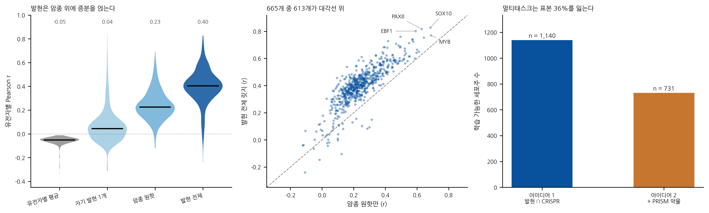
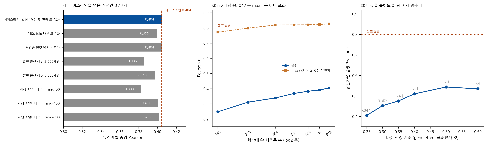

# AI에게 물어본 질답 정리 (DepMap)

- **관련 TODO:** [2026-08-07](../../../meetings/2026-08-07.md)

## 조사 배경

- 회의에서 정한 TODO: AI(GPT 등)에게 아래를 물어보고 답변 정리
  1. 이 데이터로 무엇을 할 수 있는지 → [Q1](#q1-adni로-유전자-발현으로-crispr-의존성-예측이-가능한지)
  2. 데이터 설명 요청 → [Q2](#q2-depmap-26q1-실제-파일명-검증--아래-내용이-사실인지-확인해줘) · [Q3](#q3-그럼-최소한으로-받아야-하는-데이터가-뭐야)
  3. 구상 중인 모델이 반응할지(적합한지) 문의 → **[Q4](#q4-구상-중인-모델이-이-데이터에-반응할까-적합성-문의)** ← TODO 3개 완료
- TODO 밖에서 이어진 후속 질문
  - 성능을 더 끌어올릴 수 있는지 → **[Q5](#q5-릿지-04는-낮은-것-아닌가--0809까지-올리려면)** (결론: 천장에 근접했다)

---

## Q1. ADNI로 "유전자 발현으로 CRISPR 의존성 예측"이 가능한지
- **작성자:** @lkeonwoo94
- **날짜:** 2026-08-10
- **질문:** 지금까지 조사한 ADNI 데이터로 회의에서 정한 아이디어 1(유전자 발현 → CRISPR 의존성 예측)을 진행할 수 있는지 검토 요청
- **답변자:** Claude (Claude Code)
- **답변 시각:** 2026-08-10 18:30 KST

### A-1. ADNI로는 불가능 — 트랙이 다름

데이터가 부족한 게 아니라 **정답(label)에 해당하는 것이 아예 없다.**

- CRISPR 의존성(gene effect)은 **암세포주에 CRISPR 넉아웃을 걸고 증식을 측정한 실험값**이다. ADNI는 살아있는 사람을 추적하는 관찰 코호트 연구라 이런 실험값이 존재할 수 없다.
- ADNI `Genetic/` 에 있는 것은 TOMM40 유전형, 다유전자 위험점수(PHS), 텔로미어 길이, tau-PET GWAS 요약치 수준이다 ([genetic.md](../../../adni/genetic.md)). 세포주 단위 발현 매트릭스도, 넉아웃 스크린도 없다.

→ **ADNI 트랙과 DepMap 트랙은 완전히 별개.** 주제를 항암(DepMap)으로 정했으므로 ADNI 문서화는 일단락하고 DepMap 데이터로 넘어가야 한다.

### A-2. 아이디어 1 자체는 실현 가능 (DepMap 기준)

회의에서 나온 후보 중 **가장 현실적인 선택**이다. 다만 "모델을 돌리는 것"은 쉽고, **"평가를 제대로 하는 것"에서 성패가 갈린다.** 잘못 평가하면 R² 0.9가 나오는데 전부 허수인, 함정이 유명한 벤치마크다.

또한 이 주제는 **이미 잘 닦여 있는 길**이다. DepMap이 분기마다 Predictability 모델 결과를 함께 배포하고, Dempster et al. (2020) 등 레퍼런스 논문도 있다. 새로운 발견을 노리기는 어렵지만, **비교 기준이 명확하다는 점은 수업 프로젝트에서는 오히려 장점**이다. "우리 모델이 DepMap 공식 베이스라인 대비 어떤가"로 바로 프레이밍할 수 있다.

### A-3. 필요한 데이터 (2026-08-10 기준 아직 미다운로드)

> **2026-08-11 수정.** 아래 파일명은 최초 작성 시 24Q2~25Q2 기준으로 적혀 있었으나, **25Q3에서 Omics 파일명 체계가 바뀌어 구 이름이 전부 삭제**됐다. 실제 26Q1 파일 목록을 받아 대조한 결과로 교체했다. 검증 경위는 아래 [Q2](#q2-depmap-26q1-실제-파일명-검증--아래-내용이-사실인지-확인해줘), 26Q1 전체 파일 목록은 [DepMap 데이터 전반 조사 4](../depmap_overview/lkeonwoo94.md#4-depmap-public-26q1-전체-파일-85개) 참고.

**대상 릴리스: DepMap Public 26Q1 (2026-04-01, 최신)**

| 파일 | 역할 | 대략 규모 |
|---|---|---|
| `CRISPRGeneEffect.csv` | **출력 Y** — Chronos gene effect | 약 1,100~1,200 세포주 × 약 18,000 유전자 |
| `OmicsExpressionTPMLogp1HumanProteinCodingGenes.csv` | **입력 X** — log2(TPM+1) 발현 | 약 1,400~1,500 세포주 × 약 19,000 유전자 |
| `Model.csv` | 세포주 메타데이터 (OncotreeLineage = 암종) | 작음 |
| `SubtypeMatrix.csv` | 암종·아형 one-hot — A-4 ④ 베이스라인에 바로 사용 | 작음 |
| `CRISPRInferredCommonEssentials.csv` | common essential 목록 — A-4 ③ 3분류에 사용 | 작음 |
| `OmicsCNGeneWGS.csv`, `OmicsSomaticMutationsMatrix{Damaging,Hotspot}.csv` | 추가 입력 (2단계) | 중~대 |

**옛 이름 → 26Q1 이름** (구 이름으로는 파일을 찾을 수 없음)

| 구 이름 (~25Q2) | 26Q1 |
|---|---|
| `OmicsExpressionProteinCodingGenesTPMLogp1.csv` | `OmicsExpressionTPMLogp1HumanProteinCodingGenes.csv` |
| `OmicsCNGene.csv` | `OmicsCNGeneWGS.csv` |

- 발현 ∩ CRISPR 교집합이 실제 학습 가능한 세포주 수이며 **대략 1,000~1,100개**. 이것이 우리의 **n**이다.
- 위 숫자는 릴리스마다 바뀌므로 다운로드 시점에 확인할 것. **반드시 같은 분기 릴리스로 통일**해서 받는다(섞으면 세포주 ID가 맞지 않음).
- Chronos 값 해석: **0 = 넉아웃해도 멀쩡, -1 = 공통 필수 유전자의 중앙값 수준으로 죽음.** 음수로 갈수록 의존성이 크다.

**다운로드 전 주의 3가지**

1. **발현 파일은 Stranded / 비-Stranded 두 종류가 있고 공식 권장이 없다.** DepMap이 25Q2 노트에서 "strandedness 외의 배치 효과 요인을 보정할 방법을 탐색 중"이라고 밝힌 상태. 어느 쪽을 썼는지 반드시 기록할 것. 배치보정판은 25Q2에서 제거됐고 대체 파일이 없다.
2. **`OmicsCNGeneWGS.csv`는 log2가 아니다.** 해당 세포주 자신의 ploidy 대비 **선형 비율**이라 `~1.0 = 변화 없음`이며, 4배체 세포주에서 4카피인 유전자도 1.0이 된다. log2가 필요하면 `PortalOmicsCNGeneLog2.csv`를 쓴다.
3. **25Q3부터 omics 테이블에 메타데이터 컬럼이 붙는다** (`ModelID`, `IsDefaultEntryForModel`, `ModelConditionID`, `IsDefaultEntryForMC`, `SequencingID`). 한 모델이 여러 행을 가질 수 있으므로 `IsDefaultEntryForModel == "Yes"` 로 먼저 필터링해야 한다. 안 하면 중복 세포주가 학습셋에 들어가 A-4 (부수) 항목의 누출이 그대로 발생한다.

### A-4. 이 주제의 진짜 함정 4가지

**① 전역 R²로 평가하면 안 된다 (가장 흔한 실패)**
18,000개 유전자 중 대부분은 모든 세포주에서 gene effect가 거의 0으로 붙박이다. 세포×유전자 쌍을 전부 모아 R²를 계산하면 모델이 "유전자별 평균"만 외워도 0.9가 넘는다. 아무것도 예측하지 못한 것이다.
→ **평가는 반드시 유전자별로, 세포주 축을 따라 Pearson r을 계산**하고 그 분포를 본다.

**② "유전자별 평균 예측" 베이스라인을 반드시 이겨야 한다**
위와 같은 이유로 이 베이스라인이 매우 강하다. 명시적으로 넣고 비교하지 않으면 결과 해석이 불가능하다.

**③ 예측 가능한 유전자는 소수 — 그게 정상이고, 그게 결과다**
교차검증에서 r > 0.5로 예측되는 유전자는 전체의 몇 % 수준(수백 개)에 그친다. 이를 "실패"로 볼 게 아니라 **"어떤 유전자가 예측 가능한가"를 찾아내는 것 자체가 결과물**이다. 따라서 처음부터 유전자를 세 부류로 나눠 따로 보고한다.

- 공통 필수(common essential) — 분산이 없어 예측이 무의미
- **선택적 의존(selective) — 분산 큰 상위 약 1,500~2,000개. 여기가 전장(戰場)**
  - *(2026-08-11 실측: 표준편차 > 0.25 기준 **665개**, > 0.20 기준 1,531개. 파일럿은 665개로 진행)*
- 비발현/무의존 — 사실상 상수

**④ 암종(lineage)만으로 맞히는 것을 발현의 공로로 착각하기 쉽다**
"흑색종 세포주면 SOX10에 의존한다" 같은 것은 발현을 보지 않고 암종만 알아도 맞힌다.
→ **암종 원핫만 넣은 베이스라인**을 따로 돌려, 발현이 그 위에 얹어주는 증분을 보여야 의미가 있다.

**(부수) 분할은 반드시 세포주 단위로.** (gene, cell) 쌍 단위로 섞어 나누면 같은 세포주가 train/test에 동시에 들어가 누출된다.

### A-5. 권장 설계

> **2026-08-11 실측 대조.** 아래 원문은 데이터를 받기 전에 쓴 것이다. 판단이 어떻게 바뀌었는지
> 남기기 위해 원문은 고치지 않고, 실제로 돌려본 결과만 여기 붙인다. 근거는 [D-4](#d-4-계산-비용--gpu가-필요한가).
>
> | 원문의 판단 | 실측 |
> |---|---|
> | "Elastic Net 이 실제로 가장 강한 축" | ❌ **틀렸다.** 릿지가 이겼다 — 중앙값 r **0.404 vs 0.354**, r>0.3 비율 83.1% vs 68.9%. 665개 중 Elastic Net 이 앞선 유전자는 92개(14.5%)뿐. 단 릿지는 특징 19,215개 전부, Elastic Net 은 상위 200개만 쓴 설정 차이가 있다 |
> | "선택적 의존 유전자 약 1,500개로 한정" | ⚠️ **기준에 따라 다르다.** 표준편차 > 0.25 로 자르면 **665개**, > 0.20 이면 1,531개다. 실제 파일럿은 665개로 돌렸다 |
> | "ElasticNetCV 는 CPU로 매우 오래 걸린다 / 몇 시간" | ⚠️ **절반만 맞았다.** sklearn 기본 설정으로는 665개에 49.5분이 맞지만, 설정을 완화하면 **4.4분**으로 줄고 품질은 거의 그대로였다 ([D-4](#d-4-계산-비용--gpu가-필요한가)) |
> | 1단계 "parquet 변환" | ⚠️ **npy 가 더 나았다.** 컬럼이 18,000개가 넘어 parquet 은 컬럼별 오버헤드가 크다. 실측으로 npy 가 20배 빠르고 파일도 작았다 ([`scripts/depmap_cache.py`](../../../../scripts/depmap_cache.py)) |
> | 5단계 "패럴로그가 잡히면 정상 작동 신호" | ✅ **그대로 재현됐다.** `FAM50A` 의 1위 계수가 패럴로그 `FAM50B`(+0.404)였고, `EBF1` 은 상위 계수가 전부 B세포 마커(VPREB3·MS4A1·PAX5·CD19)였다 ([enet 노트북](../../../../notebooks/pilot_idea1_enet.ipynb) 5장) |

**모델** — 딥러닝은 1단계에서 비추천. n≈1,000에 p≈19,000이라 **Elastic Net이 DepMap 공식 베이스라인이자 실제로 가장 강한 축**이다. XGBoost는 비교군, MLP/Multi-task는 그 다음. 회의록의 "구현 난이도 낮고 해석 용이"라는 판단은 정확하며, 그것이 성립하는 것은 선형 모델로 갈 때다.

**계산량 주의** — 18,000개 유전자 각각에 ElasticNetCV를 돌리면 CPU로 매우 오래 걸린다. **선택적 의존 유전자 약 1,500개로 한정**하면 몇 시간 안에 끝난다. 처음부터 전체를 돌릴 생각은 하지 않는 편이 좋다.

**단계**

1. 데이터 수령 후 교집합 세포주 확정 → parquet 변환 (CSV를 그대로 반복 로딩하면 너무 느림)
2. gene effect 분산 기준으로 타깃 유전자 선별 + 3분류 라벨링
3. 베이스라인 3종 (유전자별 평균 / 암종만 / 자기 자신 발현만)
4. Elastic Net → 유전자별 r 분포 보고
5. 잘 맞는 유전자의 상위 계수 확인 — 여기서 **자기 자신 발현이나 패럴로그(SMARCA2↔SMARCA4, ARID1A↔ARID1B 등)가 잡히면 파이프라인이 정상 작동한다는 신호**다. 새 발견이 아니라 검증 지표로 사용한다.

---


## Q2. DepMap 26Q1 실제 파일명 검증 — 아래 내용이 사실인지 확인해줘

- **작성자:** @lkeonwoo94
- **날짜:** 2026-08-11
- **질문:** 별도로 GPT/Claude 에 물어본 DepMap 다운로드 가이드(아래 접힌 원문)가 26Q1 기준으로 맞는지 검증 요청
- **답변자:** Claude (Claude Code)
- **답변 시각:** 2026-08-11 KST

**질문 배경**

- 위 [A-3](#a-3-필요한-데이터-2026-08-10-기준-아직-미다운로드) 및 별도로 GPT에 물어본 답변에서 **다운로드할 파일명이 다수 틀린 것**을 발견.
- 원인: 25Q3에서 Omics 파일 이름 체계가 대대적으로 바뀌었는데, 학습 데이터가 그 이전(24Q2~25Q2) 기준이라 구버전 이름을 그대로 답한 것.
- DepMap 포털이 2026년 중 Cloudflare 캡차를 걸어서 파일 목록을 프로그래밍 방식으로 볼 수 없게 됐고, 그래서 AI들이 "확인 못 했다"며 추측으로 답하는 상황.
- → **공식 파일 목록을 직접 받아서 대조**한 결과를 여기 남긴다.

<details>
<summary>접기/펼치기</summary>


판단·추천 레이어를 빼고, 해당되는 파일을 층위별로 전부 나열하는 형태로 다시 정리할게. 무엇을 고를지는 네가 결정하는 걸로.

**파일명 검증 안내:** 26Q1 파일 목록을 직접 열어보지 못했어(포털 봇 확인). 아래 파일명 중 릴리스 노트·논문에서 실제로 확인된 것은 ✅, 이전 릴리스 기준이라 26Q1에서 이름이 바뀌었을 수 있는 것은 ◻로 표시했어. ◻는 릴리스 페이지 목록에서 대조해줘.

---

**릴리스 현황 (사실)**

- **DepMap Public 26Q1** — 최신. 2026년 4월 1일 공개
- **PRISM Repurposing Public 24Q2** — PRISM 공개 최신. DepMap 본 릴리스와 주기가 별개라 26Q1과 시점이 어긋남
- **PRISM Repurposing (Corsello 2020)** — primary/secondary 레거시 릴리스, figshare 상주
- 25Q2 이후 DepMap 본 릴리스는 figshare에 미러링되지 않고, 포털 Custom Downloads 탭도 세포주/유전자 필터를 걸어야 다중 파일을 받을 수 있음

---

**1. CRISPR 의존성 — 층위별 전체**

| 파일 | 단위 | 내용 | 링크 |
|---|---|---|---|
| ✅ `CRISPRGeneEffect.csv` | model × gene | Chronos 점수. 모델 단위로 통합됨. 0 = 무영향, −1 = pan-essential 중앙값 | [포털](https://depmap.org/portal/data_page/?file=CRISPRGeneEffect.csv&release=DepMap+Public+26Q1&tab=allData) |
| ✅ `CRISPRGeneEffectUncorrected.csv` | model × gene | 동일하되 보정 전 값 | [포털](https://depmap.org/portal/data_page/?file=CRISPRGeneEffectUncorrected.csv&release=DepMap+Public+26Q1&tab=allData) |
| ◻ `CRISPRGeneDependency.csv` | model × gene | Chronos 점수를 EM으로 0~1 의존 확률로 변환. 귀무 분포는 비발현 유전자와 nonessential 목록에서 잡음 | [포털](https://depmap.org/portal/data_page/?file=CRISPRGeneDependency.csv&release=DepMap+Public+26Q1&tab=allData) |
| ✅ `ScreenGeneEffect.csv` | **screen** × gene | 개별 스크린 단위. 한 모델이 Avana·KY·Humagne로 중복 스크리닝되면 각각 별도 행 | [포털](https://depmap.org/portal/data_page/?file=ScreenGeneEffect.csv&release=DepMap+Public+26Q1&tab=allData) |
| ✅ `ScreenGeneEffectUncorrected.csv` | screen × gene | 위의 보정 전 | [포털](https://depmap.org/portal/data_page/?file=ScreenGeneEffectUncorrected.csv&release=DepMap+Public+26Q1&tab=allData) |
| ✅ `ScreenSequenceMap.csv` | sequence | 스크린–시퀀싱 런–모델–라이브러리 대응표 | [포털](https://depmap.org/portal/data_page/?file=ScreenSequenceMap.csv&release=DepMap+Public+26Q1&tab=allData) |
| ◻ `AvanaRawReadcounts.csv` / `KYRawReadcounts.csv` / `HumagneRawReadcounts.csv` | sgRNA × sequence | 원시 NGS 리드카운트. Chronos 재현의 출발점 | [All Data 탭에서 검색](https://depmap.org/portal/data_page/?tab=allData) |
| ◻ `AvanaGuideMap.csv` 등 | sgRNA | guide–유전자 매핑, 라이브러리 설계 | 〃 |
| ◻ RNAi (`D2_combined_gene_dep_scores.csv`) | model × gene | DEMETER2 shRNA 넉다운 의존성. CRISPR와 별개 실험 | 〃 |

26Q1에서 Chronos의 library correction 범위가 "모든 라이브러리에 존재하는 유전자"에서 "2개 이상 screen batch에 존재하는 유전자"로 확장돼 `CRISPRGeneEffect.csv`·`ScreenGeneEffect.csv`의 library batch effect가 줄었고, 파일 포맷은 그대로야. Copy Number 결측으로 빠졌던 스크린 3건(SC-001956/957/958.AV01)이 복귀했어.

---

**2. Omics — 전체**

| 파일 | 내용 | 단위/스케일 | 링크 |
|---|---|---|---|
| ✅ `OmicsExpressionProteinCodingGenesTPMLogp1.csv` | 단백질코딩 RNA-seq 발현. GTEx 파이프라인 정량 | log2(TPM+1) | [포털](https://depmap.org/portal/data_page/?file=OmicsExpressionProteinCodingGenesTPMLogp1.csv&release=DepMap+Public+26Q1&tab=allData) |
| ◻ `OmicsExpressionTranscriptsTPMLogp1Profile.csv` | 전사체 단위 발현 | log2(TPM+1) | [All Data](https://depmap.org/portal/data_page/?tab=allData) |
| ✅ `OmicsSomaticMutationsMatrixDamaging.csv` | LoF 판정 변이 | 0/1/2 | [포털](https://depmap.org/portal/data_page/?file=OmicsSomaticMutationsMatrixDamaging.csv&release=DepMap+Public+26Q1&tab=allData) |
| ✅ `OmicsSomaticMutationsMatrixHotspot.csv` | hotspot 변이(활성화 변이 포함). 26Q1부터 HLA 유전자는 hotspot 제외 | 0/1/2 | [포털](https://depmap.org/portal/data_page/?file=OmicsSomaticMutationsMatrixHotspot.csv&release=DepMap+Public+26Q1&tab=allData) |
| ✅ `OmicsSomaticMutations.csv` / `OmicsSomaticMutationsMAFProfile.maf` | 변이 전체 롱포맷/MAF. 행렬로 압축되기 전 원본 | long | [All Data](https://depmap.org/portal/data_page/?tab=allData) |
| ✅ `OmicsCNGene.csv` | 유전자 단위 상대 copy number | log2(상대CN+1), 1 ≈ 2배체 | [포털](https://depmap.org/portal/data_page/?file=OmicsCNGene.csv&release=DepMap+Public+26Q1&tab=allData) |
| ◻ `OmicsAbsoluteCNGene.csv` | PureCN 기반 절대 copy number (24Q2 도입) | 정수 카피수 | [All Data](https://depmap.org/portal/data_page/?tab=allData) |
| ◻ `OmicsFusionFiltered.csv` | 융합 유전자 콜 | long | 〃 |
| ◻ `OmicsSignatures.csv` | 24Q2 도입 유전체 시그니처 (MSI, 변이 시그니처 등) | model × feature | 〃 |
| ✅ `harmonized_Olink_2023_best_dilution.csv` | Olink Explore HT 단백체. 161개 세포주, 24개 lineage. model_id × UniProt ID. 단백질별로 최적 희석배수 하나를 선택함. 이 데이터셋 일부 모델은 다른 omics·스크린 데이터가 없음 | model × protein | Harmonized Public Proteomics 26Q1 |
| ✅ `harmonized_Sanger_MS_2022.csv` | Gonçalves et al. 2022 질량분석 상대 정량. Cell Model Passports 출처 | model × protein | 〃 |

---

**3. PRISM 약물 반응**

**24Q2** — 📦 [figshare 전체 목록](https://figshare.com/articles/dataset/Repurposing_Public_24Q2/25917643)

| 파일 | 내용 | 링크 |
|---|---|---|
| ✅ `Repurposing_Public_24Q2_Extended_Primary_Data_Matrix.csv` | cell line × compound LFC **행렬** | [포털](https://depmap.org/portal/data_page/?file=Repurposing_Public_24Q2_Extended_Primary_Data_Matrix.csv&release=PRISM+Repurposing+Public+24Q2&tab=allData) |
| ✅ `Repurposing_Public_24Q2_LFC_COLLAPSED.csv` | 동일 값 **long format**. QC 통과 replicate median-collapse, 단일 농도 2.5 µM, DMSO 대비 | [포털](https://depmap.org/portal/data_page/?file=Repurposing_Public_24Q2_LFC_COLLAPSED.csv&release=PRISM+Repurposing+Public+24Q2&tab=allData) |
| ◻ treatment/compound metadata | 화합물별 target·MOA 주석 | figshare 목록에서 `Treatment`/`Compound` 포함 파일 확인 |

24Q2 = Repurposing-1M(1,280) + Repurposing-300(234), 총 1,514개 화합물 × 906개 세포주(859개 QC 통과), 2.5 µM 5일 처리, triplicate, 플레이트당 Bortezomib 20 µM 양성·DMSO 음성 대조. PR500A(부착) + PR500B(부착+부유) = PR1000 컬렉션이고, PR500B가 기존 패널에 새 subtype·lineage를 더함

**Secondary (Corsello 2020 레거시)** — 1,448개 화합물 × 499개 세포주, 10 µM부터 4배 희석 8단계 · [전체 목록](https://depmap.org/repurposing/)

| 파일 | 내용 | 링크 |
|---|---|---|
| `secondary-screen-readme.txt` | 처리 절차 | [7.5 KB](https://ndownloader.figshare.com/files/20238123) |
| `secondary-screen-dose-response-curve-parameters.csv` | IC50·EC50·AUC·상한/하한 | [252 MB](https://ndownloader.figshare.com/files/20237739) |
| `secondary-screen-replicate-collapsed-logfold-change.csv` | 농도별 LFC | [87 MB](https://ndownloader.figshare.com/files/20237757) |
| `secondary-screen-replicate-collapsed-treatment-info.csv` | 화합물 주석 | [3.6 MB](https://ndownloader.figshare.com/files/20237763) |
| `secondary-screen-cell-line-info.csv` | 세포주 주석 | [40 KB](https://ndownloader.figshare.com/files/20237769) |
| primary 계열 5종 | 4,518개 화합물 × 578/562개 세포주 | [같은 페이지](https://depmap.org/repurposing/) |

---

**4. 메타데이터·참조 목록**

| 파일 | 내용 | 링크 |
|---|---|---|
| ✅ `Model.csv` | 세포주 메타데이터. lineage, 원발 질환, OncoTree 코드, 배양 조건. 26Q1에서 OncoTree 2025-10-09 기준 재주석, CNS/Brain 대규모 재분류 | [포털](https://depmap.org/portal/data_page/?file=Model.csv&release=DepMap+Public+26Q1&tab=allData) |
| ◻ `OmicsProfiles.csv` / `OmicsDefaultModelProfiles.csv` | 모델–omics 프로파일 매핑. 25Q2·25Q3에서 갱신됨 | [All Data](https://depmap.org/portal/data_page/?tab=allData) |
| ✅ `AchillesCommonEssentialControls.csv` | Hart·Blomen essential 교집합. Chronos 의존 분포의 기준 | [포털](https://depmap.org/portal/data_page/?file=AchillesCommonEssentialControls.csv&release=DepMap+Public+26Q1&tab=allData) |
| ✅ `AchillesNonessentialControls.csv` | Hart reference nonessential. 귀무 분포의 기준 | [포털](https://depmap.org/portal/data_page/?file=AchillesNonessentialControls.csv&release=DepMap+Public+26Q1&tab=allData) |
| ◻ `CRISPRInferredCommonEssentials.csv` | 해당 릴리스에서 common essential로 추론된 유전자 목록 | [포털](https://depmap.org/portal/data_page/?file=CRISPRInferredCommonEssentials.csv&release=DepMap+Public+26Q1&tab=allData) |
| ◻ `AchillesHighVarianceGenes.csv` | 세포주 간 분산이 큰 유전자 목록 | [All Data](https://depmap.org/portal/data_page/?tab=allData) |

---

**5. 선택에 영향을 주는 사실들**

**조인 키** — `ModelID` (ACH-XXXXXX). 유전자 컬럼은 `SYMBOL (ENTREZID)` 형태라 파싱 필요. 레거시 PRISM(Corsello)은 `depmap_id` 컬럼명을 씀.

**커버리지** — CRISPR 스크린 모델 수 < 발현 프로파일 모델 수. PRISM 24Q2는 906개(QC 통과 859개). 세 데이터의 교집합이 실제 학습 샘플 수를 결정하고, Olink 단백체는 161개라 이걸 넣으면 교집합이 크게 줄어듦.

**스케일 방향** — PRISM LFC와 CRISPR gene effect 둘 다 음수 = 세포가 죽음/의존. 단 두 타깃의 분산 크기는 다름.

**결측** — `CRISPRGeneEffect.csv`에 NaN 존재(라이브러리별 유전자 커버리지 차이).

**common essential의 성질** — 이 유전자들은 정의상 세포주 간 분산이 거의 없음. 타깃에 포함하면 모델이 세포주 정보 없이도 예측 가능한 성분이 들어가고, 제외하면 예측 대상이 selective dependency로 좁혀짐. 두 설정의 성능 지표는 직접 비교되지 않음.

**model-level vs screen-level** — `CRISPRGeneEffect`는 모델당 1행, `ScreenGeneEffect`는 스크린당 1행. 후자를 쓰면 같은 모델이 중복 등장하므로 split 설계가 달라짐. 동시에 같은 모델의 스크린 간 차이는 측정 재현성의 경험적 범위를 준다.

**용량** — 발현 파일이 전체의 절반 이상. A/B/C 최소 구성 기준 대략 3~4 GB, 원시 리드카운트까지 포함하면 수십 GB.

**배포** — 26Q1은 파일 단위 개별 다운로드. PRISM 24Q2와 레거시 Corsello 릴리스는 figshare에서 일괄 가능.

</details>


### B. 검증 방법과 결과

**검증 방법 —** 포털 UI와 `https://depmap.org/portal/api/download/files` 는 캡차 뒤에 있지만,
2026-07-14에 DepMap이 **캡차 없는 엔드포인트**를 열었다. 이걸로 공식 파일 목록을 통째로 받아 대조했다.

```bash
curl -s "https://depmap.org/portal/api/no-captcha/download/files" -o depmap_files.csv
```

2026-08-11 기준 전체 1,436개 파일 / `DepMap Public 26Q1` 85개.
엔드포인트 상세·제약(‌`url` 컬럼 없음 → 자동 다운로드 불가)은 [overview 1](../depmap_overview/lkeonwoo94.md#1-파일-목록을-직접-받는-법-캡차-없음) 참고.

**결과 — 접힌 원문의 파일명은 상당수가 틀렸다.** 원인은 25Q3의 Omics 파일명 전면 개편이다.

| 접힌 원문의 이름 (~25Q2 기준) | 실제 26Q1 이름 |
|---|---|
| `OmicsExpressionProteinCodingGenesTPMLogp1.csv` ✅로 표기됨 | `OmicsExpressionTPMLogp1HumanProteinCodingGenes.csv` |
| `OmicsCNGene.csv` ✅로 표기됨 | `OmicsCNGeneWGS.csv` (⚠️ log2 아님) |
| `OmicsSignatures.csv` | `OmicsGlobalSignatures.csv` |
| `OmicsSomaticMutationsMAFProfile.maf` | `OmicsSomaticMutationsMAF.maf` |
| `AchillesHighVarianceGenes.csv` | `AchillesHighVarianceGeneControls.csv` |
| `OmicsAbsoluteCNGene.csv` | **폐기됨** (24Q4 이후 미제공) |
| `OmicsDefaultModelProfiles.csv` | **폐기됨** → `OmicsProfiles.csv` 의 `is_default_entry` 컬럼 |
| `D2_combined_gene_dep_scores.csv` (RNAi) | 26Q1 릴리스에 없음 |

**주의할 점:** 원문이 ✅(릴리스 노트·논문에서 확인됨)로 표시한 항목 중에도 틀린 것이 있었다.
즉 **AI가 붙인 확신 표시 자체를 신뢰할 수 없다.** ◻만 대조하면 놓친다.

또한 원문의 "Corsello 2020 레거시 figshare를 써야 한다"는 안내도 불필요하다 —
DepMap이 표준 스키마로 재처리한 `Harmonized PRISM Repurposing Secondary Screen 25Q2` 가 있다.

> **26Q1 전체 파일 목록(85개)·릴리스 현황·용량·다운로드 링크·라이선스는 [DepMap 데이터 전반 조사](../depmap_overview/lkeonwoo94.md) 로 옮겼다. 그쪽이 정본이다.**
>
> - [1. 파일 목록을 직접 받는 법 (캡차 없음)](../depmap_overview/lkeonwoo94.md#1-파일-목록을-직접-받는-법-캡차-없음)
> - [2. 릴리스 현황](../depmap_overview/lkeonwoo94.md#2-릴리스-현황-2026-08-11-기준)
> - [3. 25Q3에서 바뀐 파일명](../depmap_overview/lkeonwoo94.md#3-25q3에서-바뀐-파일명-가장-중요)
> - [4. DepMap Public 26Q1 전체 파일 (85개)](../depmap_overview/lkeonwoo94.md#4-depmap-public-26q1-전체-파일-85개)
> - [5. 약물 반응 (별도 릴리스)](../depmap_overview/lkeonwoo94.md#5-약물-반응-별도-릴리스)
> - [6. 데이터 사용 조건](../depmap_overview/lkeonwoo94.md#6-데이터-사용-조건-2026년에-바뀜)
> - [7. 다운로드 전 알아둘 것](../depmap_overview/lkeonwoo94.md#7-다운로드-전-알아둘-것)

---

## Q3. 그럼 최소한으로 받아야 하는 데이터가 뭐야?

- **작성자:** @lkeonwoo94
- **날짜:** 2026-08-11
- **질문:** 그럼 최소한으로 받아야 하는 데이터가 뭐야? 표로 나타내줘. 파일명, 내용, 용량, 다운로드 링크
- **답변자:** Claude (Claude Code)
- **답변 시각:** 2026-08-11 KST

> **\* 용량은 참고치.** 26Q1 실측 용량은 캡차 뒤에만 있어 확인 불가. 값은 figshare에 미러링된 **24Q4 실측치**이며 26Q1은 이보다 다소 크다. 24Q4에 대응 파일이 없으면 `—`. 근거는 [DepMap 데이터 전반 조사 4](../depmap_overview/lkeonwoo94.md#4-depmap-public-26q1-전체-파일-85개).
> 다운로드 링크는 포털 All Data 탭이며 **캡차를 한 번 통과해야 한다.**

### C-1. 최소 구성 — 5개 파일, 약 0.95 GB

[A-5](#a-5-권장-설계)의 1단계(발현 → CRISPR 의존성, Elastic Net)를 돌리는 데 **이것만 있으면 된다.**

| 파일 | 내용 | 용량* | 다운로드 |
|---|---|---|---|
| `CRISPRGeneEffect.csv` | **출력 Y.** Chronos gene effect (model × gene). 0 = 무영향, −1 = pan-essential 중앙값 | 429 MB | [받기](https://depmap.org/portal/data_page/?tab=allData&releasename=DepMap+Public+26Q1&filename=CRISPRGeneEffect.csv) |
| `OmicsExpressionTPMLogp1HumanProteinCodingGenes.csv` | **입력 X.** log2(TPM+1) 단백질코딩 발현 | 507 MB | [받기](https://depmap.org/portal/data_page/?tab=allData&releasename=DepMap+Public+26Q1&filename=OmicsExpressionTPMLogp1HumanProteinCodingGenes.csv) |
| `Model.csv` | 세포주 메타데이터. `OncotreeLineage` = 암종. 층화·그룹 분할·베이스라인에 필수 | 646 KB | [받기](https://depmap.org/portal/data_page/?tab=allData&releasename=DepMap+Public+26Q1&filename=Model.csv) |
| `CRISPRInferredCommonEssentials.csv` | common essential 유전자 목록. **없으면 R²가 부풀려진다** | 21 KB | [받기](https://depmap.org/portal/data_page/?tab=allData&releasename=DepMap+Public+26Q1&filename=CRISPRInferredCommonEssentials.csv) |
| `README.txt` | 행·열 의미, 단위, 결측 처리. 받자마자 읽을 것 | 43 KB | [받기](https://depmap.org/portal/data_page/?tab=allData&releasename=DepMap+Public+26Q1&filename=README.txt) |

앞의 두 개가 전체 용량의 99%다. 나머지 3개는 합쳐서 1 MB도 안 되지만, **없으면 결과 해석 자체가 불가능**하다.

### C-2. 강력 권장 — 평가 설계에 필요 (+17 MB)

모델을 돌리는 데는 없어도 되지만, [A-4](#a-4-이-주제의-진짜-함정-4가지)의 함정을 피하려면 실질적으로 필요하다.

| 파일 | 내용 | 용량* | 다운로드 |
|---|---|---|---|
| `SubtypeMatrix.csv` | 암종·아형 one-hot. 「암종만으로 맞히는」 베이스라인을 바로 만들 수 있음 | — | [받기](https://depmap.org/portal/data_page/?tab=allData&releasename=DepMap+Public+26Q1&filename=SubtypeMatrix.csv) |
| `AchillesCommonEssentialControls.csv` | Hart·Blomen essential. **양성 대조군** — 파이프라인 검증용 | 17 KB | [받기](https://depmap.org/portal/data_page/?tab=allData&releasename=DepMap+Public+26Q1&filename=AchillesCommonEssentialControls.csv) |
| `AchillesNonessentialControls.csv` | Hart nonessential. **음성 대조군** | 11 KB | [받기](https://depmap.org/portal/data_page/?tab=allData&releasename=DepMap+Public+26Q1&filename=AchillesNonessentialControls.csv) |
| `Gene.csv` | Gene symbol ↔ Ensembl/Entrez/HGNC 매핑. 유전자 컬럼 파싱이 꼬일 때 필요 | 17 MB | [받기](https://depmap.org/portal/data_page/?tab=allData&releasename=DepMap+Public+26Q1&filename=Gene.csv) |

### C-3. 2단계 — 입력을 늘릴 때 (+2 GB)

1단계 결과가 나온 뒤에 받아도 늦지 않다. 특히 CN 파일이 1.4 GB로 무겁다.

| 파일 | 내용 | 용량* | 다운로드 |
|---|---|---|---|
| `OmicsSomaticMutationsMatrixHotspot.csv` | 활성화 변이(KRAS G12C, BRAF V600E 등). damaging에는 안 잡힘 | 4.2 MB | [받기](https://depmap.org/portal/data_page/?tab=allData&releasename=DepMap+Public+26Q1&filename=OmicsSomaticMutationsMatrixHotspot.csv) |
| `OmicsSomaticMutationsMatrixDamaging.csv` | LoF 판정 변이 | 148 MB | [받기](https://depmap.org/portal/data_page/?tab=allData&releasename=DepMap+Public+26Q1&filename=OmicsSomaticMutationsMatrixDamaging.csv) |
| `OmicsCNGeneWGS.csv` | 유전자 단위 상대 CN. ⚠️ log2 아님 — ploidy 대비 선형비, `~1.0` = 변화 없음 | 1.4 GB | [받기](https://depmap.org/portal/data_page/?tab=allData&releasename=DepMap+Public+26Q1&filename=OmicsCNGeneWGS.csv) |
| `CRISPRGeneDependency.csv` | 0~1 의존 확률. 회귀 대신 분류로 갈 때의 라벨 | 421 MB | [받기](https://depmap.org/portal/data_page/?tab=allData&releasename=DepMap+Public+26Q1&filename=CRISPRGeneDependency.csv) |

### C-4. 약물 반응까지 갈 경우 (선택)

멀티태스크(약물 + CRISPR 동시 예측)로 확장할 때만. **릴리스가 달라 세포주 교집합이 크게 줄어든다** — 먼저 교집합 수부터 세고 결정할 것.

| 파일 | 내용 | 용량* | 다운로드 |
|---|---|---|---|
| `REPURPOSINGAUCMatrix.csv` | **약물 타깃.** cell line × compound AUC 행렬 (용량-반응 기반) | — | [받기](https://depmap.org/portal/data_page/?tab=allData&releasename=Harmonized+PRISM+Repurposing+Secondary+Screen+25Q2&filename=REPURPOSINGAUCMatrix.csv) |
| `REPURPOSINGResponseCurves.csv` | 곡선 적합 파라미터. AUC 해석·QC용 | — | [받기](https://depmap.org/portal/data_page/?tab=allData&releasename=Harmonized+PRISM+Repurposing+Secondary+Screen+25Q2&filename=REPURPOSINGResponseCurves.csv) |
| `PortalCompounds.csv` | 화합물 메타데이터. target 유전자·MOA — 「왜 듣는가」에 필수 | 692 KB | [받기](https://depmap.org/portal/data_page/?tab=allData&releasename=DepMap+Public+26Q1&filename=PortalCompounds.csv) |

### C-5. 받지 말 것

용량만 크고 이 프로젝트에 쓸 데가 없다.

| 파일 | 왜 안 받나 |
|---|---|
| `AvanaLogfoldChange.csv` (3.4 GB), `KYLogfoldChange.csv` (1.6 GB), `*RawReadcounts.csv` | Chronos 파이프라인 재현용. 우리는 이미 처리된 gene effect를 쓴다 |
| `OmicsExpressionTranscript*.csv` (4.2 GB) | 전사체 단위. 유전자 단위로 충분 |
| `ScreenGeneEffect.csv` 계열 | **같은 세포주가 중복 행으로 들어와 누출된다.** [overview 4-2](../depmap_overview/lkeonwoo94.md#4-2-crispr--스크린-단위-학습에-쓰면-안-됨) 참고 |
| `OmicsExpression{ExpectedCount,RawReadCount,EffectiveLength}*.csv` | TPM 재계산용 원자료 |

### C-6. 정리

| 단계 | 파일 수 | 누적 용량 | 무엇을 할 수 있나 |
|---|---|---|---|
| C-1 | 5 | ~0.95 GB | 발현 → CRISPR 의존성 예측 + 베이스라인 비교 |
| C-1 + C-2 | 9 | ~0.97 GB | 위 + 함정 4가지를 통제한 제대로 된 평가 |
| \+ C-3 | 13 | ~3 GB | 다중 오믹스 입력, 입력별 기여도 비교 |
| \+ C-4 | 16 | ~3 GB+ | 약물 반응 멀티태스크 |

**C-1 부터 받아서 교집합 세포주 수(n)를 먼저 확인하는 것을 권한다.** n이 예상보다 작으면 이후 설계가 통째로 바뀐다.

---

## Q4. 구상 중인 모델이 이 데이터에 반응할까? (적합성 문의)

- **작성자:** @lkeonwoo94
- **날짜:** 2026-08-11
- **질문:** 회의록 [2026-08-07](../../../meetings/2026-08-07.md) 의 **아이디어 1·2** 가 실제로 이 데이터에서 작동할지 물어봤다.
  - **Q4-1** — [Q3의 C-1 최소 구성](#c-1-최소-구성--5개-파일-약-095-gb)만으로 했을 때
  - **Q4-2** — 전체 데이터셋으로 했을 때
    - **Q4-2-1** — 아이디어 1 (발현 → CRISPR 의존성)
    - **Q4-2-2** — 아이디어 2 (약물 + CRISPR 멀티태스크)
- **답변자:** Claude (Claude Science)
- **답변 시각:** 2026-08-11 KST

> **이 답변은 의견이 아니라 실측이다.** 앞선 Q1~Q3 이 「무엇이 있는가」였다면, 여기서는
> 이미 받아둔 `raw/DepMap/` 파일로 **실제 파일럿을 돌려서** 답한다.
> 재현: `python3 scripts/pilot_idea1_ridge.py` (파일럿, 약 12초) → `python3 scripts/plot_q4_d1.py` (그림)
> 결과: [`results/tables/pilot_idea1_ridge_gene_scores.csv`](../../../../results/tables/pilot_idea1_ridge_gene_scores.csv) · [`results/figures/q4_d1_baseline_comparison.png`](../../../../results/figures/q4_d1_baseline_comparison.png)
> 그림 파일명 규칙은 [results/figures/README.md](../../../../results/figures/README.md) 참고.
>
> 📓 **코드를 읽으려면 노트북이 낫다.** 같은 계산을 단계별로 풀어 쓰고 각 단계가 왜 필요한지
> 설명을 붙인 판이 있다 — [`notebooks/pilot_idea1_ridge.ipynb`](../../../../notebooks/pilot_idea1_ridge.ipynb).
> CRISPR 의존성이 무엇인지부터 시작하므로 **비전공자도 따라올 수 있게** 썼다.
> 모델 수식은 `src/models/` 에서 불러다 쓰므로 스크립트와 결과가 갈라지지 않는다.
> Elastic Net 쪽은 [`notebooks/pilot_idea1_enet.ipynb`](../../../../notebooks/pilot_idea1_enet.ipynb)
> — 「예측이 되는가」가 아니라 **「무엇을 보고 맞혔는가」**(계수 해석)를 다룬다.

> **2026-08-11 수치 갱신.** 릿지의 leave-one-out 공식에서 절편 항(`+ 1/n`)이 빠져 있던 것을
> 발견해 고쳤다([`src/models/ridge.py`](../../../../src/models/ridge.py), 검증은
> [`tests/test_ridge.py`](../../../../tests/test_ridge.py)). LOO 오차가 작은 alpha 에서 특히
> 과소평가되어 과적합 쪽으로 치우쳐 있었다. 수정 후 성능이 올라가 아래 수치를 모두 갱신했다
> — 중앙 r 0.360 → **0.404**, 암종 베이스라인 초과 595 → **613개**.
> 베이스라인 3종(평균·암종·자기 발현)은 이 공식을 쓰지 않아 값이 그대로다.

### D-0. 요약 — 한 줄 답

| 질문 | 답 | 근거 |
|---|---|---|
| **Q4-1** C-1 최소 구성만으로 아이디어 1 | **작동한다. 추가 다운로드 없이 프로젝트가 성립한다** | 유전자별 중앙 r = **0.404**, 665개 중 **613개(92.2%)** 가 암종 베이스라인 초과 |
| **Q4-2-1** 전체 데이터로 아이디어 1 | 작동하나 **증분은 작을 것** — 발현이 이미 신호의 대부분을 갖고 있다 | 자기 발현 1개(중앙 r=0.044)·암종(0.226) → 발현 전체(0.404). CN/변이는 발현과 상관이 큼 |
| **Q4-2-2** 전체 데이터로 아이디어 2 | **1단계 완료 전에는 권하지 않는다** | 표본 1,140 → **731 (36% 감소)**, 출력 차원 2,183 = 표본의 3배. 약물-타깃 커플링은 **12,750쌍 중 20쌍**에서만 r>0.3 |

### D-1. Q4-1 — C-1 최소 구성만으로 (실측)

**설계.** 세포주 단위 5-fold 층화 CV(암종으로 층화), out-of-fold 예측으로 **유전자별** Pearson r 을
세포주 축을 따라 계산했다. [A-4](#a-4-이-주제의-진짜-함정-4가지)에서 지적한 함정 4개를 모두 통제했다.

- 타깃: common essential 제외 + gene effect 표준편차 > 0.25 → **665개 선택적 의존 유전자**
- 표본: 발현 ∩ CRISPR = **1,140 세포주**, 입력 19,215 유전자
- 결측: 타깃 행렬의 8.4% (릿지 적합 시 유전자 평균 대체, **평가 시에는 제외**)

**결과.**



> - **왼쪽** — 665개 선택적 의존 유전자의 r 분포. 가로선은 중앙값이다. 베이스라인 3종을 넘어 발현 전체가 0.404까지 올라간다.
> - **가운데** — 유전자 하나가 점 하나다. 대각선 위에 있으면 발현이 암종보다 잘 맞힌 것으로, 613개(92.2%)가 여기 해당한다. 상위 4개는 이름을 붙였다.
> - **오른쪽** — 아이디어 2로 확장할 때의 표본 손실. 이 패널만 [D-3](#d-3-q4-2-2--전체-데이터로-아이디어-2-멀티태스크) 에 관한 것이다.

| 모델 | 중앙 r | r>0.3 비율 | r>0.5 개수 |
|---|---:|---:|---:|
| 유전자별 평균 (함정 ②의 그 베이스라인) | -0.052 | 0.0% | 0 |
| 자기 자신 발현 1개 | 0.044 | 7.7% | 15 |
| 암종 원핫만 (함정 ④) | 0.226 | 27.0% | 24 |
| **발현 전체 (릿지)** | **0.404** | **83.1%** | **124** |

- 발현 전체가 암종 베이스라인을 **665개 중 613개(92.2%)** 에서 이겼고, 그중 **516개는 r 기준 0.1 이상** 앞섰다.
- 「유전자별 평균」 베이스라인 대비로는 **95.2%** 에서 우세하다.
- r>0.4가 221개, r>0.6이 25개다. [A-4 ③](#a-4-이-주제의-진짜-함정-4가지)에서 예상한 「예측 가능한 유전자는 소수」와 일치하며, **그 소수를 찾는 것 자체가 결과물**이라는 판단도 그대로 유효하다.

**파이프라인이 정상 작동한다는 신호.** 상위 예측 유전자가 교과서적 계보 의존성 유전자로 채워졌다.

| 유전자 | r (발현) | r (암종만) | 알려진 성격 |
|---|---:|---:|---|
| PAX8 | 0.805 | 0.630 | 난소·신장암 계보 인자 |
| SOX10 | 0.802 | 0.686 | 흑색종 계보 인자 |
| EBF1 | 0.783 | 0.592 | B세포 계보 |
| MYB | 0.745 | 0.690 | 조혈 계보 |
| IRF4 | 0.732 | 0.644 | 림프구·골수종 |
| TP63 | 0.728 | 0.496 | 편평상피 |

[A-5](#a-5-권장-설계) 5단계에서 「자기 자신 발현이나 패럴로그가 잡히면 정상 작동 신호」라고 적어둔 그 검증 지표에 해당한다.
상위 50개 전부 자기 발현이 입력에 존재하고, 그중 23개는 자기 발현 1개만으로도 r>0.3 이 나온다.

> **결론: C-1 다섯 개 파일(~0.95 GB)만으로 프로젝트가 성립한다.** 추가 다운로드는 성능이 아니라
> 「입력별 기여도 비교」라는 **논점을 늘리기 위한** 선택이다.

### D-2. Q4-2-1 — 전체 데이터로 아이디어 1

C-3(변이·CN)까지 넣었을 때 기대되는 증분은 **작다.** 판단 근거:

1. **발현이 이미 다른 오믹스의 정보를 상당 부분 담고 있다.** CN 증폭은 발현 증가로, LoF 변이는 발현 소실로 이어지는 경우가 많아 입력이 서로 중복된다.
2. **DepMap 공식 Predictability 모델도 발현 단독이 가장 강한 축**이라는 것이 알려진 결과다. 우리 실측도 같은 방향이다.
3. n=1,140 에 입력을 19,215 → 약 6만 차원으로 늘리면 **정규화 부담만 커진다.**

**그럼에도 받을 가치가 있는 이유는 성능이 아니라 해석이다.** hotspot 변이(4.2 MB)는 특히 저렴하다 —
KRAS G12C·BRAF V600E 같은 활성화 변이는 발현으로는 보이지 않으므로, 「이 유전자의 의존성은
변이가 설명하고 저 유전자는 발현이 설명한다」는 **입력별 기여도 분해**가 새 논점이 된다.

권장 순서: **hotspot(4.2 MB) → damaging(148 MB) → CN(1.4 GB)**. 용량 대비 논점 밀도 순이다.

### D-3. Q4-2-2 — 전체 데이터로 아이디어 2 (멀티태스크)

PRISM Repurposing 24Q2 를 실제로 받아 교집합과 전제를 측정했다. **세 가지가 걸린다.**

**① 표본이 36% 사라진다.**

| 구성 | n |
|---|---:|
| 아이디어 1 (발현 ∩ CRISPR) | 1,140 |
| 아이디어 2 (+ PRISM) | **731** |

암종도 29개 → 21개로 줄고, 그중 7개는 세포주가 10개 미만이다.

**② 출력이 표본의 3배다.**

공유 인코더 하나에 머리 두 개를 다는 구조에서, 출력 차원은 CRISPR 665 + 약물 1,518 = **2,183**.
표본은 731이다. **행보다 출력이 3배 많은 상황**이라, 딥러닝의 근거였던 「공유 표현 학습」이
오히려 과적합 통로가 된다. 아이디어 2의 장점으로 적었던 "딥러닝 적용 근거가 명확"은
이 비율 앞에서는 성립하지 않는다.

> **사용한 데이터:** `raw/PRISM_Repurposing_24Q2/` (2026-08-11 수령, figshare 미러).
> md5 검증·주의사항은 [PROVENANCE.md](../../../../../raw/PRISM_Repurposing_24Q2/meta/PROVENANCE.md) 참고.
> ⚠️ **행렬이 화합물 × 세포주 방향이다** — 전치하지 않고 조인하면 교집합이 0으로 나온다.

**③ 두 과제를 잇는 생물학적 연결이 데이터에서 약하다.**

멀티태스크의 전제는 「약물이 듣는 이유 = 그 타깃 유전자에 의존하기 때문」이다. 직접 측정했다.
화합물의 `repurposing_target` 주석과 CRISPR 의존성을 짝지어 세포주 축 상관을 계산하면:

| 짝 | 쌍 수 | r>0.3 비율 |
|---|---:|---:|
| 타깃이 일치하는 약물–유전자 | 3,978 (검사 표본) | 0.50% (20쌍) |
| 무작위 약물–유전자 | 3,870 | 0.00% (0쌍) |

- 방향은 맞다 — 타깃 일치 쌍이 무작위보다 유의하게 높다 (Mann-Whitney p = 0.0085).
- **그러나 절대 크기가 작다.** 12,750개 drug-target 쌍 중 r>0.3 은 20쌍뿐이다.
- 정준 사례를 직접 짚어보면 **되는 것과 안 되는 것이 갈린다.** (LFC·gene effect 모두 음수가 죽음이므로 **양의 상관**이 커플링 신호다.)

  | 약물 ↔ 타깃 | 해당 화합물 수 | r |
  |---|---:|---|
  | nutlin ↔ MDM2 | 2 | 0.463 / 0.731 |
  | selumetinib ↔ MAPK1 | 1 | 0.445 |
  | dabrafenib ↔ BRAF | 1 | 0.419 |
  | vemurafenib ↔ BRAF | 1 | 0.402 |
  | trametinib ↔ MAP2K1 | 1 | 0.121 |
  | bortezomib ↔ PSMB5 | 1 | **-0.070** |

  같은 MDM2 억제제 2종이 0.46과 0.73으로 갈리고, MEK 억제제도 selumetinib 0.445 ↔ trametinib 0.121로 엇갈린다.
  bortezomib↔PSMB5 는 프로테아좀이 common essential 이라 세포주 간 분산이 없어 상관이 잡히지 않는다 —
  **커플링이 보이는 것은 선택적 의존 타깃에 한한다**는 뜻이고, 이것이 위 12,750쌍 중 20쌍이라는 낮은 비율의 이유이기도 하다.
- 화합물 6,790개 중 target 주석이 있는 것은 4,413개(65%)이고, 커버리지·분산 기준을 통과한
  1,518개 중에서는 **442개만 주석이 있다.**

> **결론: 아이디어 2는 「멀티태스크로 성능을 올린다」가 아니라 「소수의 강한 커플링 사례를 찾는다」로**
> **목표를 바꾸면 성립한다.** MDM2·BRAF·MAPK1 처럼 실제로 이어진 20~40쌍을 사례 연구로 제시하는 쪽이,
> 731개 표본에 2,183개 출력을 다는 것보다 훨씬 방어 가능하다.

### D-4. 계산 비용 — GPU가 필요한가

**필요 없다.** 다만 알고리즘 선택이 중요하다. 같은 평가 설계를 세 방식으로 돌린 실측:

| 방식 | 적합 시간 | 비고 |
|---|---:|---|
| 유전자마다 ElasticNetCV — 완화 전 (`top_feat=500, n_alphas=20, tol=1e-4, max_iter=3000`) | 2,969초 (49.5분) | 665 × 5 × 3 × 20 ≈ 20만 회 좌표하강. 20 병렬 |
| **유전자마다 ElasticNetCV** (`pilot_idea1_enet.py`, **현재 기본값** `200/10/1e-3/1000`) | **263초** (4.4분) | 완화 전 대비 11.3배 빠르고 품질은 거의 그대로 — 중앙값 r 0.365 → 0.354, 유전자별 상관 0.986 |
| 릿지 + p차원 economy SVD | 112초 | 유전자 전체를 한 번에 풀지만 19,215차원 계수를 alpha마다 만든다 |
| **릿지 + Gram 행렬 고유분해** (`pilot_idea1_ridge.py`) | **11.5초** | n(1,140) ≪ p(19,215) 이므로 n×n 으로 축소 |

> 네 값 모두 **같은 기계·같은 라이브러리 구성에서 2026-08-11 실측**이다(24코어, OpenBLAS).
> ElasticNet 측정 중 다른 작업이 CPU를 일부 점유했으므로 2,969초는 다소 보수적인 값이다.

**표의 맨 위와 맨 아래가 258배 차이다 — 전부 CPU 안에서 났다.** 릿지는 닫힌 해가 있어서 train fold 를 한 번 분해하면
모든 alpha·모든 유전자의 해가 동시에 나오고, alpha 선택에 쓰는 leave-one-out 오차도
hat 행렬 대각에서 공짜로 얻는다. 결과 수치는 SVD판과 소수점까지 동일하다.

**⚠️ 이 수치는 BLAS 구현에 크게 좌우된다.** Debian/Kali 기본 numpy 는 netlib 레퍼런스 BLAS 에
링크되어 있어 24코어를 거의 쓰지 못한다(6 GFLOP/s). 이 상태에서는 같은 릿지 코드가 **65초**였고,
`sudo apt install libopenblas0-pthread` 로 교체한 뒤 **11.5초**(406 GFLOP/s)가 됐다.
**팀원 기계에서 시간이 5배 이상 다르게 나오면 모델이 아니라 BLAS 를 먼저 확인할 것.**

**Elastic Net 은 성능에서도 릿지에 졌다** — 중앙값 r **0.354 vs 0.404**, r>0.3 비율 68.9% vs 83.1%.
665개 중 Elastic Net 이 앞선 유전자는 92개(14.5%)뿐이고, 두 방법의 유전자별 점수 상관은 0.929 로
**거의 같은 유전자를 맞힌다**. 다만 릿지는 19,215개 특징을 전부 쓰고 Elastic Net 은 속도 때문에
상관 상위 500개만 쓰므로, 「원리적 우열」이 아니라 **이 설정에서의 결과**로 읽어야 한다.
[A-5](#a-5-권장-설계) 의 "Elastic Net 이 가장 강한 축" 은 이 실측으로 정정된다.

- **GPU는 이 규모에서 의미가 없다.** 데이터 전체가 175 MB 남짓이라 전송 비용이 계산보다 크다.
- GPU가 실제로 필요해지는 지점은 **아이디어 2의 신경망 멀티태스크**뿐인데, 그건 위 D-3 때문에
  당장 권하지 않는다. 필요해지면 그때 검토한다.
- Elastic Net 을 굳이 쓸 이유가 있다면(계수 희소성으로 해석) **선별된 소수 유전자에만** 적용하는 것이 맞다.

#### D-4-1. **「Elastic Net 이 오래 걸리니 GPU 로 줄일 수 있지 않나」 — 아니다.**

*(아래 측정은 설정 완화 전, 49.5분 걸리던 시점에 한 것이다.)*

먼저 설정 문제인지부터 확인했다. joblib 프로세스 20개와 OpenBLAS 스레드가 코어를 뺏는
oversubscription 을 의심해 스레드를 1로 묶고 재측정했다(유전자 40개, 665개로 환산):

| 설정 | 665개 환산 |
|---|---:|
| 스레드 제한 없음 | 61.9분 |
| `OMP_NUM_THREADS=1` | 53.2분 |

**14% 차이뿐이다.** 실제 전체 실행(49.5분)과도 일치하므로, 설정 문제가 아니라 **이 알고리즘의
정직한 비용**이다. (이 가설은 틀렸으니 다시 시험할 필요 없다.)

GPU 가 안 맞는 이유는 규모가 아니라 **문제의 모양**이다.

| | 릿지 | Elastic Net |
|---|---|---|
| 연산 구조 | 큰 행렬 분해 **1회** | 912×500 짜리 좌표하강 **약 20만 회** |
| 병렬성 | 행렬 내부에서 대량 병렬 | 좌표를 하나씩 갱신하는 **순차** 알고리즘 |

GPU 는 큰 행렬 하나를 부술 때 이긴다. Elastic Net 의 비용은 잘게 쪼개진 작은 문제 20만 개이고,
각각은 커널을 띄우는 오버헤드가 계산보다 크다. **역설적으로 GPU 가 도움이 될 쪽은 이미 11.5초로
끝나는 릿지이고, Elastic Net 은 GPU 를 붙여도 별로 줄지 않는다.**

시간을 실제로 줄이는 지렛대는 따로 있다. 수렴 경고가 계속 뜨는 것은 `max_iter=3000` 을 다 쓰고도
수렴하지 못한 적합이 많다는 뜻이므로, 반복 상한이 시간을 직접 먹고 있다.

네 가지를 한꺼번에 적용해 실제로 재봤다(`--top-feat 200 --n-alphas 10 --tol 1e-3 --max-iter 1000`).

| | 완화 전 | **현재 기본값** | 릿지 |
|---|---:|---:|---:|
| 적합 시간 | 2,969초 | **263초** | 11.5초 |
| 중앙값 r | 0.365 | 0.354 | **0.404** |
| r > 0.3 비율 | 70.2% | 68.9% | **83.1%** |
| 암종 초과 비율 | 91.1% | 91.0% | **92.2%** |

**11.3배 빨라지는데 품질 손실은 거의 없다.** 두 판의 유전자별 점수 상관은 0.986,
차이의 중앙값은 −0.009 이고, r 이 0.05 이상 나빠진 유전자는 665개 중 15개뿐이다.
**sklearn 기본 설정이 이 데이터에 과했다는 뜻이다. 이 실측에 따라 `pilot_idea1_enet.py` 의
기본값을 `200/10/1e-3/1000` 으로 바꿨다** — 그냥 돌리면 4.4분에 끝난다.
완화 전 설정으로 재현하려면 `--top-feat 500 --n-alphas 20 --tol 1e-4 --max-iter 3000`.

다만 결론은 바뀌지 않는다. 튜닝해도 **릿지보다 23배 느리고 성능은 여전히 낮다.**
665개 전체를 Elastic Net 으로 돌릴 이유가 없고, 계수 해석이 필요한 소수 유전자에만 적용하면
6초면 끝난다([enet 노트북](../../../../notebooks/pilot_idea1_enet.ipynb) 4장).

### D-5. 다음 액션

- [x] C-1 최소 구성으로 파일럿 실행 → 아이디어 1 성립 확인 (D-1)
- [ ] 교수님께 확인: **아이디어 2의 목표를 「멀티태스크 성능」에서 「약물-의존성 커플링 사례 발굴」로 바꾸는 것**이 타당한지
- [ ] hotspot 변이(4.2 MB) 추가 → 입력별 기여도 분해 (D-2)
- [ ] 릿지 → Elastic Net 비교는 상위 예측 유전자 100개에 한정해서 (D-4)
- [ ] leave-one-lineage-out 평가 — 세포주 10개 미만 lineage 5개는 제외 ([depmap/README](../../../depmap/README.md) 참고)

---

## Q5. 릿지 0.4는 낮은 것 아닌가 — 0.8~0.9까지 올리려면?

- **작성자:** @lkeonwoo94
- **날짜:** 2026-08-11
- **질문:** 릿지 성능이 0.4면 그렇게 높은 건 아닌 것 같은데? 어떻게 0.8~0.9까지 끌어올릴 수 있을까? 무슨 데이터를 더 가져오거나, 무슨 알고리즘으로 전환 시도해보는 게 좋을까?
- **답변자:** Claude (Claude Code)
- **답변 시각:** 2026-08-11 KST

> **이 답변도 실측이다.** [Q4](#q4-구상-중인-모델이-이-데이터에-반응할까-적합성-문의)가 「되는가」를 물었다면
> 여기서는 **「어디까지 되는가」**를 묻는다. 개선안 8종과 학습곡선 7점을 실제로 돌렸다.
> 재현: `python3 scripts/q5_ceiling.py` (약 5분) → `python3 scripts/plot_q5_e3.py` (그림)
> 결과: [`results/tables/q5_ceiling_ablation.csv`](../../../../results/tables/q5_ceiling_ablation.csv) ·
> [`q5_ceiling_learning_curve.csv`](../../../../results/tables/q5_ceiling_learning_curve.csv) ·
> [`q5_ceiling_sd_sweep.csv`](../../../../results/tables/q5_ceiling_sd_sweep.csv)

### E-0. 요약 — 한 줄 답

| 질문 | 답 |
|---|---|
| 0.8~0.9로 올릴 수 있나 | **정직한 방법으로는 불가능하다.** 목표로 잡으면 십중팔구 [A-4 ①](#a-4-이-주제의-진짜-함정-4가지)의 누출로 「달성」된다 |
| 알고리즘을 바꾸면 | **개선안 7종 전부 베이스라인에 졌다.** 그리고 어떤 설정에서도 max r이 0.833을 못 넘었다 |
| 데이터를 더 가져오면 | **안 오른다.** n 2배당 중앙 r +0.042. 0.8까지 외삽하면 세포주 **약 67만 개**가 필요하다 |
| 그럼 뭘 해야 하나 | **천장을 측정해서 「천장 대비 몇 %를 회수했는가」로 프레이밍을 바꾼다.** [E-4](#e-4-천장의-정체--그리고-그것을-재는-법) |

### E-1. 먼저 — 0.404는 무엇의 숫자인가

이것은 모델 하나의 성능 점수가 아니라 **665개 유전자 각각의 r을 모은 분포의 중앙값**이다.

| 분위 | r |
|---|---:|
| p05 | 0.114 |
| p25 | 0.336 |
| **p50 (보고값)** | **0.404** |
| p75 | 0.475 |
| p95 | 0.617 |
| **최댓값** | **0.828** |

**이미 최상위 유전자는 r ≈ 0.8이다** — [D-1](#d-1-q4-1--c-1-최소-구성만으로-실측)의 PAX8 0.805, SOX10 0.802, EBF1 0.783.
따라서 「0.8~0.9로 올린다」는 요구는 실질적으로 **665개의 절반이 PAX8만큼 잘 맞아야 한다**는 뜻이다.

### E-2. 실측 A — 알고리즘·특징 개선은 전부 실패했다

[D-1](#d-1-q4-1--c-1-최소-구성만으로-실측)과 동일한 평가 설계(세포주 단위 5-fold 층화 CV)를 유지하고 입력·타깃 처리만 바꿨다.

| 설정 | 중앙 r | r>0.5 | r>0.8 | **max r** |
|---|---:|---:|---:|---:|
| **0. 베이스라인 (발현 19,215, 전역 표준화)** | **0.4044** | 19.6% | 3 | 0.828 |
| 0b. 대조: fold 내부 표준화 | 0.3992 | 19.1% | 3 | 0.827 |
| 1. + 암종 원핫 명시적 추가 | 0.4044 | 19.7% | 3 | 0.828 |
| 2a. 발현 분산 상위 2,000개만 | 0.3861 | 16.7% | 3 | **0.833** |
| 2b. 발현 분산 상위 5,000개만 | 0.3973 | 19.4% | 3 | 0.832 |
| 3a. 저랭크 멀티태스크 rank=50 | 0.3830 | 15.1% | 1 | 0.812 |
| 3b. 저랭크 멀티태스크 rank=150 | 0.4008 | 18.6% | 1 | 0.818 |
| 3c. 저랭크 멀티태스크 rank=300 | 0.4017 | 18.9% | 1 | 0.819 |

**베이스라인을 이긴 설정이 하나도 없다.** 개별 해석:

- **암종 원핫 추가(1)는 소수점 넷째 자리까지 동일하다.** 발현 19,215차원이 이미 암종 정보를 완전히 담고 있다는 뜻이다. [D-1](#d-1-q4-1--c-1-최소-구성만으로-실측)에서 암종 베이스라인이 0.226이었던 것과 모순되지 않는다 — 암종은 유용하지만 **발현에 대해 새로운 정보가 아니다.**
- **특징 선택(2)은 오히려 해롭다.** 릿지는 이미 정규화로 무의미한 특징을 억제하므로, 미리 잘라내면 정보만 잃는다.
- **저랭크 멀티태스크(3)는 rank를 올릴수록 베이스라인에 수렴할 뿐 넘지 못한다.** 타깃끼리 강도를 빌려주는 효과보다 축약에서 잃는 것이 크다. 구현은 [`src/models/ridge.py`](../../../../src/models/ridge.py)의 `ridge_lowrank_cv` 에 반증용으로 남겨뒀다.
- **0b(fold 내부 표준화)가 0.3992로 약간 낮은 것**은 베이스라인의 전역 표준화가 미세한 전처리 누출을 갖고 있다는 뜻이다. 차이가 0.005라 결론은 바뀌지 않지만, **정식 보고 시에는 0b 쪽 수치를 쓰는 것이 정직하다.**

> **가장 중요한 것은 마지막 열이다.** 모델을 어떻게 바꿔도 **가장 잘 맞는 유전자조차 0.833에서 멈춘다.**
> 이건 모델의 한계가 아니라 **데이터에 천장이 있다**는 신호다.

### E-3. 실측 B — 세포주를 더 구해도 안 오른다

「n을 늘리면 되지 않나」가 자연스러운 다음 생각이라 학습곡선을 그렸다. test fold는 그대로 두고 **train fold 크기만** 줄였다.



| train n | 중앙 r | r>0.3 | r>0.5 | **max r** |
|---:|---:|---:|---:|---:|
| 136 | 0.2473 | 34.4% | 6.8% | 0.772 |
| 228 | 0.3108 | 52.8% | 9.3% | 0.799 |
| 364 | 0.3386 | 66.1% | 13.2% | **0.819** |
| 501 | 0.3682 | 72.6% | 15.6% | 0.820 |
| 638 | 0.3828 | 76.8% | 17.2% | 0.821 |
| 775 | 0.3912 | 80.1% | 18.1% | 0.823 |
| **912 (현재)** | **0.4044** | 83.1% | 19.6% | 0.828 |

- **n을 2배로 늘려도 중앙 r은 +0.042만 오른다.** 이 기울기로 0.8까지 외삽하면 **세포주 약 67만 개**가 필요하다. 인류가 확립한 암세포주 전체가 약 2,000개다.
- **max r은 n=364에서 이미 0.819로 포화됐다.** 세포주를 2.5배 늘리는 동안 상한이 0.009 올랐다.

→ **더 많은 데이터도, 더 좋은 알고리즘도 답이 아니다.**

### E-4. 천장의 정체 — 그리고 그것을 재는 법

CRISPR gene effect는 통계량이 아니라 **실험 측정값**이다. 세포에 넉아웃을 걸고 증식을 재서 나온 값이라 측정 노이즈가 있다. 예측 성능의 이론적 상한은 **같은 세포주를 다시 스크리닝했을 때 두 값의 상관**이다. 노이즈가 낀 값은 아무리 좋은 모델도 노이즈까지 맞힐 수 없다.

관측된 0.833이 그 상한 근처일 가능성이 높다. **직접 측정할 수 있다.**

`ScreenGeneEffect.csv`를 받아 같은 `ModelID`가 여러 라이브러리(Avana / KY / Humagne)로 중복 스크리닝된 케이스를 찾고, 같은 665개 타깃에 대해 두 스크린 값의 세포주 축 상관을 재면 된다. [Q2 5절](#q2-depmap-26q1-실제-파일명-검증--아래-내용이-사실인지-확인해줘)에 이미 *"같은 모델의 스크린 간 차이는 측정 재현성의 경험적 범위를 준다"*고 적어둔 그 값이다. 매핑은 `ScreenSequenceMap.csv`로 한다.

> ⚠️ [C-5](#c-5-받지-말-것)에서 `ScreenGeneEffect` 계열을 「받지 말 것」으로 분류했는데, 그것은
> **학습에 쓰면 같은 세포주가 중복 행으로 들어와 누출된다**는 뜻이다. **천장 측정에는 정확히 이 파일이 필요하다.**
> 용도가 다르므로 C-5의 판단과 충돌하지 않는다 — 학습셋에는 여전히 넣지 않는다.

이 숫자가 나오면 프로젝트의 프레이밍이 달라진다.

| | |
|---|---|
| ~~지금~~ | ~~"우리 모델은 r = 0.404다"~~ (약해 보인다) |
| **바꾼 뒤** | **"측정 재현성 상한이 0.XX인데 발현만으로 그 YY%를 회수했다"** |

수업 프로젝트에서 이 프레이밍은 성능을 0.45로 올리는 것보다 훨씬 방어력이 높다.

### E-5. 그래도 실제로 오를 여지

작지만 정당한 것들. **중앙값을 크게 올리지는 못한다는 점을 전제로** 진행한다.

| 항목 | 기대 증분 | 근거 |
|---|---|---|
| **hotspot 변이 추가** (4.2 MB) | 중앙값은 거의 안 움직임. **KRAS·BRAF 계열 소수 유전자에서 큼** | [D-2](#d-2-q4-2-1--전체-데이터로-아이디어-1) — 활성화 변이는 발현으로 보이지 않는다 |
| **결측 처리 개선** | 소폭 | 현재 타깃 8.4% 결측을 유전자 평균으로 채워 적합한다([`pilot_idea1_ridge.py`](../../../../scripts/pilot_idea1_ridge.py) 73행). 유전자별로 관측 세포주만 써서 적합하면 결측이 많은 유전자에서 개선 여지가 있다. 커널 분해를 타깃마다 다시 해야 해서 느려진다 |
| **Stranded / 비-Stranded 결정** | 미지 | [A-3 주의 1](#a-3-필요한-데이터-2026-08-10-기준-아직-미다운로드)의 미결 사항. 양쪽을 다 돌리면 배치 효과의 크기를 잴 수 있다 |

**알고리즘 전환은 기대하지 말 것.** Elastic Net은 이미 졌고(0.365 vs 0.404, [D-4](#d-4-계산-비용--gpu가-필요한가)), 저랭크 멀티태스크도 위에서 졌다. XGBoost·MLP는 n=1,140에 p=19,215인 구조에서 릿지를 이길 가능성이 낮다 — **이 문제는 강한 정규화가 걸린 선형 모델이 최적점이다.**

> 참고: 체크리스트에 남아 있던 `IsDefaultEntryForModel` 필터링은 코드상 **이미 적용돼 있다**
> ([`src/preprocessing/depmap_io.py`](../../../../src/preprocessing/depmap_io.py) 67행, 중복 ModelID 0건).
> 즉 현재 0.404는 [A-3 주의 3](#a-3-필요한-데이터-2026-08-10-기준-아직-미다운로드)의 누출로 부풀려진 값이 아니다.

### E-6. 0.8~0.9를 「달성」하는 부정직한 방법들

목표를 0.8로 잡으면 누군가는 아래 중 하나로 도달한다. **팀 전체가 미리 알고 있어야 한다.**

| 방법 | 나오는 값 | 왜 가짜인가 |
|---|---|---|
| 전역 R² (세포×유전자 쌍 전체) | R² > 0.9 | [A-4 ①](#a-4-이-주제의-진짜-함정-4가지) — 유전자별 평균만 외워도 나온다 |
| common essential을 타깃에 포함 | ↑ | 분산이 없는 유전자가 분모를 채운다 |
| (gene, cell) 쌍 단위로 분할 | ↑↑ | 같은 세포주가 train/test 양쪽에 들어간다 |

**다만 이것은 정당한 선택지다** — SD 컷을 올려 대상을 좁히는 것:

| SD 컷 | 유전자 수 | 중앙 r | r>0.5 |
|---:|---:|---:|---:|
| 0.25 (현재) | 634 | 0.4044 | 19.6% |
| 0.30 | 316 | 0.4519 | 31.6% |
| 0.35 | 160 | 0.4750 | 40.6% |
| 0.40 | 72 | 0.5095 | 54.2% |
| **0.50** | 17 | **0.5432** | 70.6% |
| 0.60 | 5 | 0.5341 | 60.0% |

> 유전자 수가 665가 아니라 634인 것은 r이 정의되지 않는 31개(결측 과다·분산 0)를 제외했기 때문이다.

가장 선택적인 17개만 봐도 0.543이다. 이건 **「성능 향상」이 아니라 「대상 축소」**라고 명시해서 보고하면 정직하다. 그리고 이 표 자체가 0.8이 불가능하다는 또 하나의 증거다 — **가장 예측하기 쉬운 유전자만 골라도 중앙값이 0.55를 못 넘는다.**

### E-7. 다음 액션

- [ ] **`ScreenGeneEffect.csv` + `ScreenSequenceMap.csv` 로 측정 재현성 천장 산출** ([E-4](#e-4-천장의-정체--그리고-그것을-재는-법)) — 최우선. 학습셋에는 넣지 않는다
- [ ] 보고 수치를 0b(fold 내부 표준화, 0.3992)로 교체할지 결정 ([E-2](#e-2-실측-a--알고리즘특징-개선은-전부-실패했다))
- [ ] 결과 프레이밍을 「천장 대비 회수율」로 전환 — 교수님께 함께 확인
- [ ] hotspot 변이 추가 후 **어떤 유전자에서** 올랐는지 유전자 단위로 보고 ([E-5](#e-5-그래도-실제로-오를-여지))

> **결론: [A-4 ③](#a-4-이-주제의-진짜-함정-4가지)에 이미 적어둔 판단이 숫자로 확인됐다** —
> *"예측 가능한 유전자는 소수 — 그게 정상이고, 그게 결과다."*
> 목표는 「중앙 r을 올린다」가 아니라 **「왜 어떤 유전자는 맞고 어떤 유전자는 안 맞는가」**여야 한다.

---

## 결론 / 다음 액션

- **AI가 알려주는 DepMap 파일명은 25Q2 이하 기준일 가능성이 높으니 그대로 믿지 말 것.** ✅(확인됨)로 표시한 항목도 틀렸다.
- 26Q1 파일명의 실측 정본은 [DepMap 데이터 전반 조사 4](../depmap_overview/lkeonwoo94.md#4-depmap-public-26q1-전체-파일-85개) 다. 파일명·용량·링크는 그 문서에서만 관리한다.
- **성능 목표를 숫자로 잡지 말 것.** [Q5](#q5-릿지-04는-낮은-것-아닌가--0809까지-올리려면) 실측 결과 0.404는 이미 천장 근처이고, 0.8을 목표로 두면 누출로 「달성」된다.
- [x] 위 [C-1](#c-1-최소-구성--5개-파일-약-095-gb) 대로 26Q1 최소 구성 다운로드 → `raw/DepMap/` 배치
- [x] `IsDefaultEntryForModel` 필터링 → 교집합 세포주 수 확정 (n = 1,140)
- [ ] Stranded / 비-Stranded 중 무엇을 쓸지 결정 (양쪽 shape·상관 비교 후)
- [ ] 약물 반응까지 확장할지 결정 (PRISM primary LFC vs Harmonized Secondary AUC)
- [ ] **측정 재현성 천장 산출** ([E-4](#e-4-천장의-정체--그리고-그것을-재는-법)) — Q5 이후 최우선

> 검증에 쓴 출처(릴리스 노트·포럼 스레드)는 [DepMap 데이터 전반 조사 § 검증에 쓴 출처](../depmap_overview/lkeonwoo94.md#검증에-쓴-출처) 에 정리했다.
