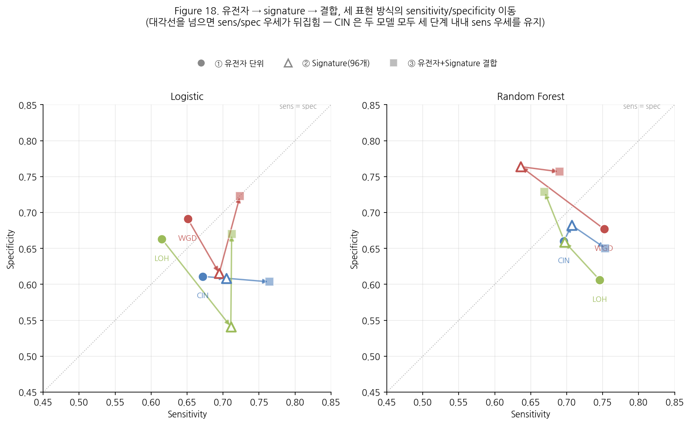
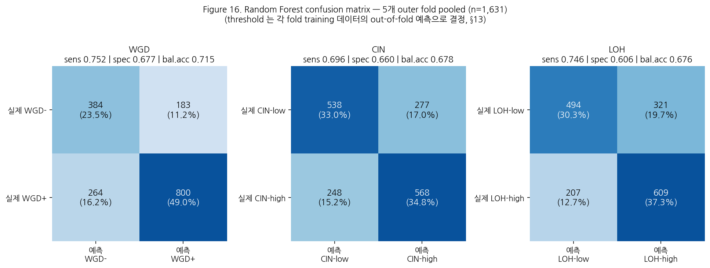

# 모델 비교 및 성능 상세

Day 10(§26②)의 다섯 모델 비교 요약과, 그중 최고 성능 모델인 Random
Forest 의 confusion matrix 를 정리한다. 원 데이터·근거는
[2026-08-16/final_conclusion.md §26②](../2026-08-16/final_conclusion.md)
를 따른다 — 이 문서는 confusion matrix 라는 새 산출물을 추가한 것이다.

---

## 1. 모델 비교 요약 (random 5×5 nested CV)

| 모델 | 평균 ROC-AUC | 표준편차 |
| --- | ---: | ---: |
| **Random Forest** | **0.743** | 0.019 |
| XGBoost | 0.738 | 0.016 |
| CatBoost | 0.730 | 0.028 |
| Elastic Net | 0.714 | 0.034 |
| Logistic | 0.693 | 0.027 |
| Multi-task ANN | 0.681 | 0.020 |

표현형별 상세(`day10_model_comparison.csv`):

| 표현형 | 모델 | ROC-AUC | PR-AUC | Balanced Acc | Sensitivity | Specificity | F1 | Brier |
| --- | --- | ---: | ---: | ---: | ---: | ---: | ---: | ---: |
| WGD | **Random Forest** | 0.765 | 0.841 | 0.715 | 0.752 | 0.677 | 0.781 | 0.204 |
| WGD | CatBoost | 0.762 | 0.838 | 0.704 | 0.721 | 0.688 | 0.763 | 0.182 |
| WGD | XGBoost | 0.757 | 0.837 | 0.713 | 0.727 | 0.698 | 0.770 | 0.183 |
| WGD | Elastic Net | 0.749 | 0.822 | 0.703 | 0.721 | 0.684 | 0.762 | 0.201 |
| WGD | Logistic | 0.723 | 0.800 | 0.671 | 0.651 | 0.691 | 0.717 | 0.209 |
| WGD | Multi-task ANN | 0.704 | 0.790 | 0.650 | 0.690 | 0.610 | 0.726 | 0.217 |
| CIN | **Random Forest** | 0.734 | 0.706 | 0.678 | 0.696 | 0.660 | 0.684 | 0.216 |
| CIN | XGBoost | 0.729 | 0.694 | 0.668 | 0.770 | 0.567 | 0.699 | 0.211 |
| CIN | CatBoost | 0.711 | 0.675 | 0.656 | 0.723 | 0.589 | 0.678 | 0.217 |
| CIN | Elastic Net | 0.681 | 0.641 | 0.639 | 0.740 | 0.537 | 0.671 | 0.230 |
| CIN | Logistic | 0.672 | 0.640 | 0.641 | 0.672 | 0.611 | 0.652 | 0.240 |
| CIN | Multi-task ANN | 0.671 | 0.648 | 0.619 | 0.713 | 0.524 | 0.649 | 0.250 |
| LOH | **Random Forest** | 0.730 | 0.696 | 0.676 | 0.746 | 0.606 | 0.698 | 0.217 |
| LOH | XGBoost | 0.728 | 0.696 | 0.673 | 0.746 | 0.599 | 0.694 | 0.210 |
| LOH | CatBoost | 0.717 | 0.682 | 0.670 | 0.748 | 0.593 | 0.693 | 0.215 |
| LOH | Elastic Net | 0.711 | 0.673 | 0.666 | 0.733 | 0.599 | 0.686 | 0.218 |
| LOH | Logistic | 0.683 | 0.660 | 0.639 | 0.615 | 0.663 | 0.630 | 0.234 |
| LOH | Multi-task ANN | 0.667 | 0.653 | 0.622 | 0.552 | 0.693 | 0.587 | 0.250 |

**Random Forest 가 세 표현형 모두에서 1위**이며(08-16 §26②), fold 간
표준편차도 가장 작다. 비선형 모델(RF/XGBoost/CatBoost, 평균
0.73\~0.74)이 선형 모델(평균 0.69\~0.71)을 일관되게 앞서지만 그 차이는
0.05 내외다. Multi-task ANN 은 최하위로, 세 표현형 간 공유 표현의
이득이 이 설정에서는 관측되지 않았다(RQ4 부정적 결과, 08-16 §26②).

재현: `python scripts/06_compare_models.py`.

### 참고 — Mutation signature(96-class) 표현으로 다시 본 성능

위 표는 전부 **유전자 단위**(필터 후 \~2,062개 feature) 입력 기준이다.
같은 random 5-fold 조건에서 입력을 유전자 대신
**mutation signature(96-class, 08-19 Future Work 실행분)** 로 바꾸면
어떻게 달라지는지 참고로 덧붙인다 — 모델은 두 개(Logistic, Random
Forest)만 비교했다(08-19 additional_results.md §4).

| 표현형 | 모델 | 유전자 단위 ROC-AUC | Signature(96개) ROC-AUC | 차이 |
| --- | --- | ---: | ---: | ---: |
| WGD | Logistic | 0.723 | 0.713 | -0.010 |
| WGD | Random Forest | 0.765 | 0.770 | **+0.005** |
| CIN | Logistic | 0.672 | 0.711 | **+0.039** |
| CIN | Random Forest | 0.734 | 0.762 | **+0.028** |
| LOH | Logistic | 0.683 | 0.693 | +0.010 |
| LOH | Random Forest | 0.730 | 0.743 | +0.013 |

§1의 유전자 단위 표와 같은 형식으로 나머지 지표까지 상세히 보면
(`day24_signature_summary.csv`, random 5-fold 평균):

| 표현형 | 모델 | ROC-AUC | PR-AUC | Balanced Acc | Sensitivity | Specificity | F1 | Brier |
| --- | --- | ---: | ---: | ---: | ---: | ---: | ---: | ---: |
| WGD | Logistic | 0.713 | 0.802 | 0.655 | 0.695 | 0.616 | 0.729 | 0.212 |
| WGD | Random Forest | 0.770 | 0.857 | 0.700 | 0.636 | 0.764 | 0.720 | 0.188 |
| CIN | Logistic | 0.711 | 0.682 | 0.657 | 0.705 | 0.609 | 0.670 | 0.216 |
| CIN | Random Forest | 0.762 | 0.750 | 0.695 | 0.707 | 0.682 | 0.698 | 0.203 |
| LOH | Logistic | 0.693 | 0.681 | 0.626 | 0.711 | 0.541 | 0.655 | 0.222 |
| LOH | Random Forest | 0.743 | 0.741 | 0.678 | 0.697 | 0.659 | 0.684 | 0.209 |

§1(유전자 단위)의 Random Forest 행과 나란히 놓고 보면 흥미로운 지점이
있다. **WGD 는 sensitivity/specificity 의 균형이 크게 달라진다** —
유전자 단위(sens 0.752 / spec 0.677)는 sensitivity 가 높은 쪽으로
치우쳐 있는데, signature 단위(sens 0.636 / spec 0.764)는 정반대로
specificity 가 더 높다. Balanced accuracy(0.715 vs 0.700)는 비슷해도
**어느 쪽 오류를 더 허용하는지가 표현 방식에 따라 달라진다**는 뜻이다
— 확정 배포 전에는 이 트레이드오프 자체도 확인해야 한다. CIN·LOH 는
두 표현 사이에 sensitivity/specificity 균형 차이가 WGD 만큼 크지
않다. Brier(확률 보정)는 세 표현형 모두 signature 쪽이 근소하게
낮다(더 좋다) — 특히 WGD 는 0.204→0.188.

**① 유전자 단위 → ② signature(96개) → ③ 유전자+signature 결합**(biomarker_panel.md
§5, `panel_size="all"` 기준)까지 세 단계를 이어서 보면 그림이 더
분명해진다.

| 표현형 | 모델 | ①→②→③ sens/spec 우세 | 대각선을 넘는 지점 |
| --- | --- | --- | --- |
| WGD | Logistic | spec우세 → sens우세 → sens우세 | ①→② |
| WGD | Random Forest | sens우세 → spec우세 → spec우세 | ①→② |
| CIN | Logistic | sens우세 → sens우세 → sens우세 | 없음 |
| CIN | Random Forest | sens우세 → sens우세 → sens우세 | 없음 |
| LOH | Logistic | spec우세 → sens우세 → sens우세 | ①→② |
| LOH | Random Forest | sens우세 → sens우세 → **spec우세** | ②→③ |

**CIN 만 두 모델 모두, 세 단계 내내 sensitivity 우세를 그대로
유지한다** — 표현 방식을 뭘 쓰든 CIN 의 오류 패턴(양성을 더 잘
잡고 음성을 더 놓치는 방향)은 안정적이라는 뜻이다. 반대로 WGD 와
LOH 는 최소 한 번은 대각선을 넘는다 — WGD 는 ①→②(유전자→signature)
단계에서, LOH·Random Forest 는 오히려 ②→③(signature→결합) 단계에서
넘어간다는 점이 다르다. **즉 "표현 방식을 바꾸면 트레이드오프
방향이 흔들리는 표현형(WGD, LOH)"과 "안 흔들리는 표현형(CIN)"이
갈린다** — 어떤 표현으로 패널을 배포하든 CIN 은 예측 가능한 오류
패턴을 유지하지만, WGD·LOH 는 어떤 조합을 쓰느냐에 따라 "어느 쪽
오류를 감수할지"가 달라질 수 있다는 뜻이라 실무 적용 시 주의가
필요하다.

재현: `python scripts/36_plot_sens_spec_tradeoff.py`.

**Random Forest + Signature(96개, CIN) 조합(0.762)이 이 문서 전체를
통틀어 CIN 에서 가장 높은 ROC-AUC 다** — §1 표의 유전자 단위 5개 모델
비교(CIN 최고 0.734, Random Forest)보다도 높다. 다만 입력 차원이
전혀 다르고(2,062개 유전자 vs 96개 signature class), 5개 모델 전부와
비교한 것도 아니라서 "§1 모델 비교표"에 그대로 합쳐 넣지는 않았다 —
**"어떤 모델이 최고인가"와 "어떤 입력 표현이 최고인가"는 서로 다른
축의 질문**이라는 점을 분명히 하기 위해서다. 유전자 단위와 signature
를 같은 nested CV 안에서 함께 feature selection 시킨 결합 실험은
[biomarker_panel.md §5](biomarker_panel.md#5-후속--유전자--signature-결합-패널-실행-결과)
에 정리했다 — 결합 시 6/6 조합 전부 성능이 더 오른다(Random Forest
+WGD 0.797, 이 프로젝트 전체 최고 ROC-AUC).

재현: `python scripts/24_signature_representation.py`.

---

## 2. Random Forest confusion matrix (최고 성능 모델)

5개 outer fold 의 test 예측을 모두 모아(pooled) 하나의 confusion
matrix 로 합쳤다 — outer fold 하나당 세포주가 \~326개뿐이라 fold별로
쪼개면 칸이 너무 작아진다. 분류 threshold 는 각 fold 의 training 데이터
안에서 out-of-fold 예측으로 결정했고(§13), outer test 데이터는 threshold
결정에 전혀 관여하지 않았다.

| 표현형 | TN | FP | FN | TP | n | Sensitivity | Specificity | Balanced Acc |
| --- | ---: | ---: | ---: | ---: | ---: | ---: | ---: | ---: |
| WGD | 384 | 183 | 264 | 800 | 1,631 | 0.752 | 0.677 | 0.715 |
| CIN | 538 | 277 | 248 | 568 | 1,631 | 0.696 | 0.660 | 0.678 |
| LOH | 494 | 321 | 207 | 609 | 1,631 | 0.746 | 0.606 | 0.676 |

sensitivity/specificity 값은 `day10_model_comparison.csv` 의
random_forest 행과 정확히 일치한다(같은 config·seed 로 재현) — pooled
confusion matrix 가 기존 요약 지표와 같은 계산에서 나온 것임을 확인한다.

### 읽는 법

* **WGD (양성 65.2%)** — 대부분 WGD+ 로 예측하는 경향이 뚜렷하다.
  TP(800)+FN(264)=1,064 가 실제 WGD+ 전체이고 모델은 그중 75.2%를
  맞힌다. 반면 실제 WGD-(567명) 중 67.7%만 맞히고 183명(11.2%)을
  WGD+ 로 오분류한다 — **다수 클래스 쪽으로 편향된 오류 패턴**이며,
  이는 "모두 WGD+ 로 찍어도 정확도 65.2%"라는 08-16 §26①의 지적과
  같은 맥락이다.
* **CIN** — FP(277)와 FN(248)이 비교적 균형 잡혀 있다(WGD 대비 클래스가
  균형에 가깝기 때문). Sensitivity(0.696)와 specificity(0.660)의 격차도
  세 표현형 중 가장 작다.
* **LOH** — specificity(0.606)가 세 표현형 중 가장 낮다 — 실제
  LOH-low 의 39.4%(321/815)를 LOH-high 로 잘못 예측한다. LOH 라벨이
  0 근처로 치우친 분포(Figure 2)라는 점과 맞물려, "낮은 쪽"을
  가려내는 게 상대적으로 더 어렵다는 뜻일 수 있다.
* **공통적으로 오분류가 무작위로 흩어지지 않고 한쪽으로 쏠려 있다** —
  세 표현형 모두 FP 나 FN 어느 한쪽이 우세하다. 08-16 "이 결론의
  한계" 1번(Brier 0.20 대, 확률 보정이 좋지 않음)과 함께 읽으면, 이
  모델은 "양성 가능성이 높은 쪽으로 미는" 경향이 있어 개별 세포주
  판정의 신뢰도가 유병률/클래스 균형에 따라 달라진다는 것을 구체적인
  숫자로 보여준다.

재현: `python scripts/33_rf_confusion_matrix.py`,
`python scripts/34_plot_rf_confusion_matrix.py`.
