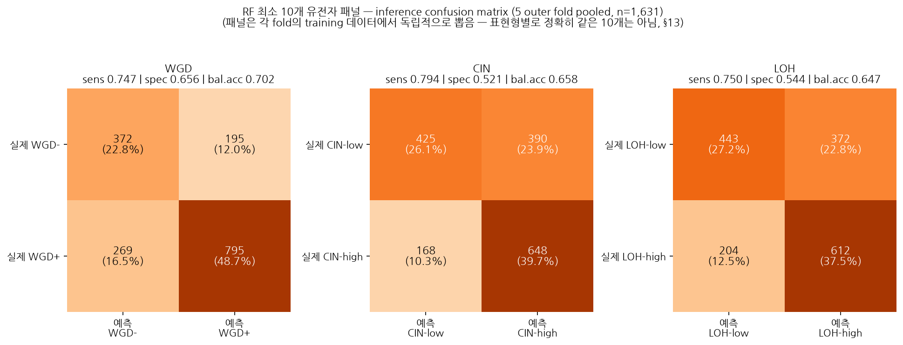
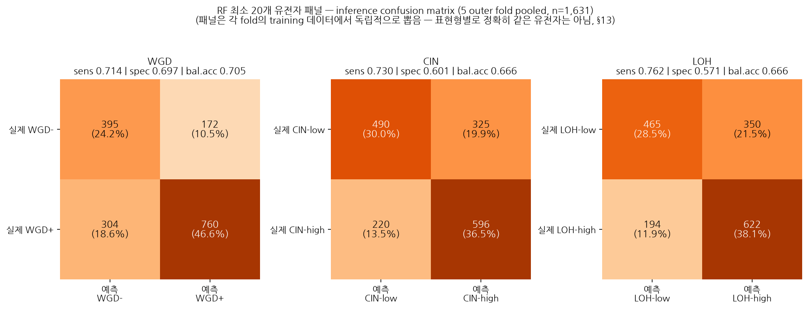

# RF 최소 유전자 패널 — Inference Confusion Matrix

`docs/research/2026-08-16/final_conclusion.md`의 "Day 11/12 Random Forest
재검증"과 `docs/gdc/`·`docs/research/2026-08-19/`의 후속 실험은 전부 **전체
feature(필터 후 \~1,200\~1,700개)로 학습한 모델**의 confusion matrix
(`docs/research/2026-08-19/model.md` §2, Figure 16)만 갖고 있었다. 이 문서는
그 대신 **Day 12 방식으로 뽑은 최소 유전자 패널**(10개, 20개)로 학습·
추론했을 때 실제 오분류 패턴이 어떻게 달라지는지를 본다.

## 무엇을 했는가

각 outer fold의 training 데이터 안에서 전체 feature로 학습한 RF importance
상위 N개(10개, 20개 각각)를 그 fold의 패널로 뽑고, 그 N개 열만으로 다시
학습해 그 fold의 test를 예측한다(§13 원칙 동일 — outer test는 패널
선택에도 학습에도 관여하지 않는다). 5개 outer fold의 test 예측을 모두
pool해 confusion matrix 하나로 합쳤다 — `scripts/33_rf_confusion_matrix.py`
(전체 feature 버전)와 정확히 같은 pooling 방식이다.

**주의**: 이 패널은 표현형마다, fold마다 정확히 같은 N개가 아니다(08-16
§26④ "Day 11/12 RF 재검증"에서 이미 확인한 대로, 10개 패널의 fold 간
Jaccard 유사도는 WGD 0.607 / CIN 0.520 / LOH 0.544에 그친다). "고정된
유전자 목록으로 추론"이 아니라 "매 fold 그 fold의 training 데이터로 뽑은
N개 패널"의 추론 성능이라는 뜻이다 — 이 방식이 §26④가 이미 결론 내린
"고정 패널보다 합의 유전자를 제시하는 게 데이터에 충실하다"는 판단과
일관되게, 이번에도 fold마다 패널 구성이 흔들리는 것을 그대로 확인했다.

## 10개 패널

| 표현형 | TN | FP | FN | TP | n | Sensitivity | Specificity | Balanced Acc |
| --- | ---: | ---: | ---: | ---: | ---: | ---: | ---: | ---: |
| WGD | 372 | 195 | 269 | 795 | 1,631 | 0.747 | 0.656 | 0.702 |
| CIN | 425 | 390 | 168 | 648 | 1,631 | 0.794 | 0.521 | 0.658 |
| LOH | 443 | 372 | 204 | 612 | 1,631 | 0.750 | 0.544 | 0.647 |



### 전체 feature 대비 비교

| 표현형 | 지표 | 전체 feature (Figure 16) | 10개 패널 (Figure 19) | 차이 |
| --- | --- | ---: | ---: | ---: |
| WGD | Sensitivity | 0.752 | 0.747 | -0.005 |
| WGD | Specificity | 0.677 | 0.656 | -0.021 |
| WGD | Balanced Acc | 0.715 | 0.702 | -0.013 |
| CIN | Sensitivity | 0.696 | 0.794 | **+0.098** |
| CIN | Specificity | 0.660 | 0.521 | **-0.139** |
| CIN | Balanced Acc | 0.678 | 0.658 | -0.020 |
| LOH | Sensitivity | 0.746 | 0.750 | +0.004 |
| LOH | Specificity | 0.606 | 0.544 | -0.062 |
| LOH | Balanced Acc | 0.676 | 0.647 | -0.029 |

## 해석

**WGD는 10개로 줄여도 오분류 패턴이 거의 그대로다** — sensitivity/
specificity 둘 다 -0.02 안쪽으로 유지된다. `TP53`(damaging+hotspot)이
모든 fold에서 압도적 1·2위(08-16 "Day 11/12 RF 재검증" §"왜 1.0이 안
되는가")라, 10개로 줄여도 핵심 신호가 거의 안 빠진다는 뜻이다.

**CIN은 패널로 줄이면 specificity가 크게 떨어진다(-0.139).** 전체
feature에서는 sensitivity/specificity가 비교적 균형 잡혀 있었는데(0.696/
0.660), 10개 패널에서는 CIN-high 쪽으로 예측이 쏠려 sensitivity는 오히려
오르고(+0.098) specificity는 크게 내려간다 — CIN-low 세포주를 CIN-high로
잘못 예측하는 비율(FP)이 390/815 ≈ 47.9%까지 늘어난다. Balanced accuracy
자체는 -0.02 정도로 크게 나빠 보이지 않지만, 이는 sensitivity 상승이
specificity 하락을 상쇄한 결과라 **"균형 잡힌 성능 유지"로 오독하면 안
된다** — 실제로는 오류의 방향 자체가 바뀐 것이다.

**LOH도 specificity가 내려간다(-0.062), 정도는 CIN보다 작다.**

**공통적으로 패널을 줄이면 specificity가 sensitivity보다 더 크게
희생된다** — 전체 feature 모델이 갖고 있던 "음성을 걸러내는" 신호 중
상당수가 10개 밖으로 밀려난다는 뜻이다. CIN에서 가장 두드러지는 것은,
CIN의 핵심 신호가 TP53 외에는 RB1/PIK3CA처럼 상대적으로 덜 압도적인
유전자들에 분산돼 있어(08-16 §26③) 10개로 줄일 때 잃는 정보가 상대적으로
더 크기 때문으로 보인다.

## 재현

```bash
python scripts/40_rf_panel_confusion_matrix.py --panel-size 10
python scripts/41_plot_rf_panel_confusion_matrix.py --panel-size 10
```

저장: `results/tables/day40_rf_panel10_confusion_matrix.csv`(요약),
`results/tables/day40_rf_panel10_picks.csv`(fold별 실제 뽑힌 10개 유전자),
`results/figures/fig19_rf_panel10_confusion_matrix.png`.

---

## 20개 패널

같은 방법을 20개 패널로도 돌렸다 — 10개에서 컸던 specificity 손실이
20개에서는 얼마나 회복되는지 본다.

| 표현형 | TN | FP | FN | TP | n | Sensitivity | Specificity | Balanced Acc |
| --- | ---: | ---: | ---: | ---: | ---: | ---: | ---: | ---: |
| WGD | 395 | 172 | 304 | 760 | 1,631 | 0.714 | 0.697 | 0.705 |
| CIN | 490 | 325 | 220 | 596 | 1,631 | 0.730 | 0.601 | 0.666 |
| LOH | 465 | 350 | 194 | 622 | 1,631 | 0.762 | 0.571 | 0.666 |



### 세 조건(전체 / 10개 / 20개) 비교

| 표현형 | 지표 | 전체 feature | 10개 패널 | 20개 패널 |
| --- | --- | ---: | ---: | ---: |
| WGD | Sensitivity | 0.752 | 0.747 | 0.714 |
| WGD | Specificity | 0.677 | 0.656 | 0.697 |
| WGD | Balanced Acc | 0.715 | 0.702 | 0.705 |
| CIN | Sensitivity | 0.696 | 0.794 | 0.730 |
| CIN | Specificity | 0.660 | 0.521 | 0.601 |
| CIN | Balanced Acc | 0.678 | 0.658 | 0.666 |
| LOH | Sensitivity | 0.746 | 0.750 | 0.762 |
| LOH | Specificity | 0.606 | 0.544 | 0.571 |
| LOH | Balanced Acc | 0.676 | 0.647 | 0.666 |

**CIN·LOH 의 specificity 손실이 20개에서 상당히 회복된다** — CIN은
0.521(10개) → 0.601(20개), LOH는 0.544 → 0.571로, 둘 다 전체 feature
(0.660/0.606) 쪽으로 절반 이상 좁혀진다. Balanced accuracy 도 CIN
0.658→0.666, LOH 0.647→0.666로 개선된다.

**WGD는 반대로 10→20에서 sensitivity가 더 떨어지고(0.747→0.714)
specificity가 오히려 오른다(0.656→0.697)** — balanced accuracy 자체는
0.702→0.705로 거의 그대로다. WGD는 애초에 10개로도 이미 핵심 신호
(TP53)를 거의 다 담고 있었기 때문에(위 "10개 패널" 해석 참고), 패널을
늘려도 이득보다는 threshold 재조정에 따른 sensitivity/specificity
재배분이 더 크게 나타나는 것으로 보인다.

**결론**: 10개 패널이 보여준 "패널을 줄이면 specificity가 크게
희생된다"는 관찰(특히 CIN)은 20개에서 상당 부분 완화된다 — 이는
08-16 §26④의 "10개 이후로는 평평하다"는 ROC-AUC 기준 결론과는 다른
관점을 보탠다. **ROC-AUC 곡선만 보면 10개와 20개가 비슷해 보이지만
(93\~99% 유지, §26④), confusion matrix 로 오분류 방향까지 보면 10개와
20개 사이에도 실질적인 차이가 있다** — 특히 CIN처럼 핵심 신호가 소수
유전자에 덜 집중된 표현형일수록 패널을 10개보다 조금 더 여유 있게
잡는 것이 specificity 손실을 줄이는 데 유효하다.

## 재현 (20개 패널)

```bash
python scripts/40_rf_panel_confusion_matrix.py --panel-size 20
python scripts/41_plot_rf_panel_confusion_matrix.py --panel-size 20
```

저장: `results/tables/day40_rf_panel20_confusion_matrix.csv`(요약),
`results/tables/day40_rf_panel20_picks.csv`(fold별 실제 뽑힌 20개 유전자),
`results/figures/fig20_rf_panel20_confusion_matrix.png`.
